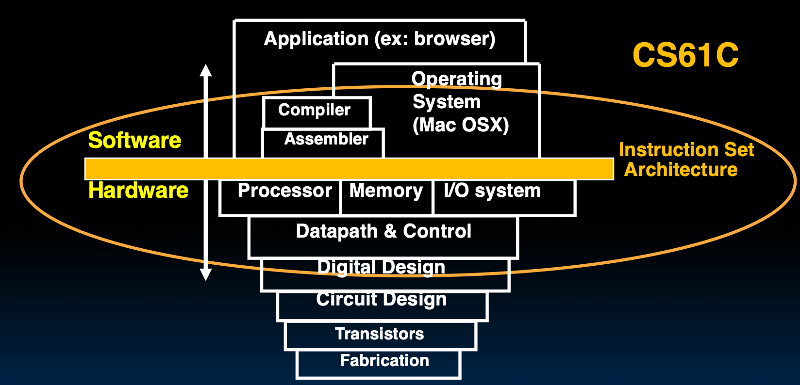

Chapter 1: Computer Abstractions and Technology

本章关注两个话题——

1. 计算机设计的八大思想、计算机系统的概念
2. 设计单处理器计算机系统，如何衡量性能指标

## 计算机系统

**计算机科学的发展**：几十年来，在 Moore's Law 摩尔定律的推动下，计算机的性能和复杂性在过去的几十年里有了显著提升，驱使人工智能技术的进步。这一定律关注集成度，也就是芯片上晶体管的数量、密度。

**计算机分类**：按大小，分为——个人计算机、服务器、高性能计算机、嵌入式计算机。

**Machine Structure**：运算器（Datapath）、控制器（Control）、存储器、输入、输出。

其中连接软件和硬件的接口是黄色部分：ISA（Instruction Set Architecture，指令集架构）是机器结构的一个重要方面，定义了程序员与计算机硬件之间的接口。只有设计好了ISA，才能设计出计算机硬件。（第二章）

常见的指令架构包括：RISC-V，x86-64，ARM，Loongarch.

**What you will learn**：

- How programs are translated into machine language.
- The hardware designers improve
- What determines program performance
- How to improve program performance
- parallel processing

**计算机设计的八大思想**：

- Design for **Moore's Law**：
- Use **abstraction** to simplify design：可以让同一个程序在不同的硬件上运行，只与ISA有关。
- Make the **common case fast**：让加法器最快，因为加法是最常用的。
- Performance vis **parallelism**：并行
- Performance via **pipelineing**：流水线
- Performance via **prediction**：预测
- **Hierarchy** of memories： 存储器的层次结构
- **Dependability** via redundacy： 冗余

**冯诺伊曼机的三个主要特点**：

- 五大部件
- 顺序执行
- 存储程序

## 性能评价

**Throughput 吞吐量**：单位时间完成的工作量。这对单CPU计算机没有意义，只对于并行计算机有意义。

**Elapsed time**：完成一个工作所需要总的时间，包括等待时间，所以不能完全体现CPU的性能。

**CPU time**：程序在 CPU 上实际消耗的时间，不含等待时间。

CPU 具有时钟周期，是固定的时间间隔 **Clock cycle time**，由 CPU Frequency 主频决定

**Clock period** 和 **Clock Frequency**：

- 一个时钟周期的时间长度

- 常见单位：
    - $1\,\text{ps}=1\times 10^{-12}\,\text{s}$.
    - 1 Ghz 表示 $10^9$ 个周期每秒，周期时间为 $1\,\text{ns}=10^{-9}\,\text{s}$.

- **Clock period** 的倒数是 **Clock Frequency**. 

每条指令需要若干个时钟周期来完成，所以可以统计总周期数来计算 CPU time：
$$
\text{CPU time} = \text{CPU clock cycles} \times \text{Clock cycle time}
$$

> 主频提高会导致周期数增加， 所以在设计 CPU 时需要考虑折中二者。

然而，计算 Clock cycle time 较为困难，因此我们引入 **Cycles Per Instruction, CPI**，表示每条指令平均需要多少个时钟周期，则：
$$
\text{CPU time} = (\text{Instruction count} \times \text{CPI})\times \text{Clock cycle time}
$$
CPI 不止与指令集相关，ISA 相同只代表 Instruction count 相同。

RISC-V 是 RISC 简单指令集，每条指令周期数差别不大，然而例如 x86 等 CISC 指令集的指令周期数差别较大，继续使用 CPI 计算 CPU time 不太适用，因此分类计算，将 CPI 拆分为各类指令的 CPI 乘以该类指令的数量之和，得到更准确的计算公式：

$$
\text{CPU time} = \left(\sum_{i=1}^{n} \text{Instruction count}_i \times \text{CPI}_i\right)\times \text{Clock cycle time}
$$

影响性能的因素：

- Algorithm: affects IC, possibly CPI

- Programming language: affects IC, CPI

- Compiler: affects IC, CPI

- Instruction set architecture: affects IC, CPI, T_c

### 谬误

提升程序部分的性能并不能提升整体性能。

Amdahl's Law：如果一个程序的某个部分加速了 S 倍，而该部分占总运行时间的 F，那么加速后的总运行时间为：
$$
\text{New Time} = \text{Old Time} \times \left((1-F) + \frac{F}{S}\right)
$$
