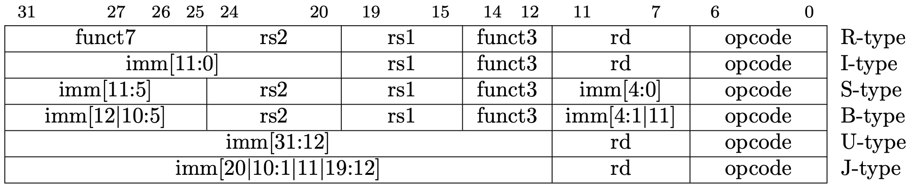

Chapter 2: Instructions: Language of the Computer

本章围绕 RISC-V 指令集展开。

RISC-V 是一种**精简指令集**计算机架构，适用于嵌入式系统。

## ISA

计算机 ISA 必须体现的三个功能：

- 计算指令：算数运算和逻辑运算
- 传送指令：CPU 需要和存储器、IO 交换数据
- 控制指令：决定程序的执行顺序

## 指令

指令一般都分为两部分：

- 操作码 OPCode，代表指令的类型。
- 操作数 Operands，表示指令的具体操作对象，个数不定。

由于操作数个数不定，指令格式也不唯一，分为变长指令和定长指令。

## RISC-V

RISC-V 采用固定长度的 32 位指令格式。

### 设计原则

- Simplicity favours regularity——使用定长指令
- Smaller is faster——使用较少的指令类型、寄存器数量
- Good design demands good compromises——在设计中做出权衡，让指令格式尽可能简单。

### 指令组成

**操作码**：用最低 7 位存储操作码，所以只能表示 128 种不同的指令，可以通过扩展技术来增加指令数量。

**操作数**：最多可以有三个操作数，共有三种：

- 寄存器 Register：
    - RISC-V 有 32 个寄存器，名字从 x0 到 x31。
    - 每个寄存器存储 32 位数据。
- 立即数 Immediate：用二进制补码表示。
- 存储器 Memory：
    - 以字节为单位寻址(8-bit)，每个存储单元有一个 32 位的地址。
    - RISC-V is Little Endian.
    - RISC-V 不要求存储器对齐(alignment)，但对齐可以提高性能。
    - 在指令中，用 address + offset 的方式访问 memory，其中 address 由寄存器提供，offset 由立即数提供。

### 指令格式



**R-type**：三个操作数都是寄存器。

- rd 是目的寄存器，rs1 和 rs2 是源寄存器。
- funct3 和 funct7 用于指令扩展——区分同一 opcode 下的不同指令。
- 包括所有运算指令。

**I-type**：有一个立即数和两个寄存器。

- **立即数运算指令**。
- **load 指令**：把存储器中的数据加载到寄存器中。
    - lw, lh, lb 分别加载 4 字节、2 字节、1 字节数据，空缺的高位用符号位扩展。

**S-type**：有一个立即数和两个寄存器，没有目的操作数 rd，用于存储。

- **store 指令**：把寄存器中的数据存储到存储器中，不需要符号扩展。  

**U-type**：用于把一个 20 位的立即数加载到寄存器的高 20 位，低 12 位清零。

- **lui 指令**：弥补了其他指令只能加载 12 位立即数的不足

- **auipc 指令**：把 pc 加上一个 20 位的立即数，结果存储到寄存器中。

- lui 和 auipc 的区别是，前者是赋值，后者是加法。

**B-type**：用于**条件分支指令**，有两个寄存器和一个立即数，没有目的操作数 rd。

- 根据两个寄存器的值决定，是否跳转到 pc + offset 处执行。
- offset 是一个有符号数，表示相对于当前 pc 的偏移量，单位是字节，会加到 pc 上。
- RISC-V 中，要求 offset 必须是 2 的倍数，所以最低位总是 0，不用存储在指令中，因此参考上面的图片，offset 截成多段存储，只用 12 个位，但范围是 $-2^{12}\sim 2^{12}-1$.

**J-type**：用于**无条件跳转指令**，有一个寄存器和一个立即数，没有源操作数 rs2。

- jal 指令：把 pc + 4 存储到 rd 中，然后跳转到 pc + offset 处执行。offset 范围是 $-2^{20}\sim 2^{20}-1$，也是因为最低位是 0，不用存储在指令中。
- jalr 指令：TODO .把 pc + 4 存储到 rd 中，然后跳转到 rs1 + offset 处执行。跳转范围更大，因为寄存器可以有很大范围的赋值。

## 同步

多个线程访问同一内存地址时，可能会出现**竞态条件**，导致数据不一致。

**原子指令**可以保证在多线程环境下，某些操作是不可中断的。

在 x86 中，原子指令通常通过**锁**来实现，锁住总线，使CPU无法与IO和Memory通信。

**RISC-V 中的原子指令**比较轻量：

- Load reserved: lr.w rd, (rs1)，其中 rs1 是要读取的地址，rd 是读取的目的寄存器。同时会把地址保留在硬件维护的**保留集**中。
- Store conditional: sc.w rd, (rs1)，其中 rs2，rs1 是要写入的地址，rs2 是要写入的数据，**rd 是结果寄存器，如果写入失败则 rd = 1**。只有当该地址仍在当前硬件维护的**保留集**中，且是有效的（未被其他线程修改），才成功。

这样就能在不加锁的情况下完成安全的原子读-改-写操作。

**保留集**：是硬件维护的一个表，程序员无法访问。它记录地址及其状态。如果中途被修改了，监控器会修改保留集的状态，导致后续的 sc.w 失败。

> 编写 RISC-V 汇编代码，使用 lr.w / sc.w 指令将以下 C 代码实现为原子的 “set max” 操作。这里，参数 shvar 包含共享变量的地址，如果 x 大于它指向的值，则应该用 x 替换：
>
> ```c
> void setmax(int* shvar, int x) {
>     // 临界区开始
>     if (x > *shvar)
>         *shvar = x;
>     // 临界区结束
> }
> ```
>
> 答案为：
>
> ```assembly
> setmax:
>     lr.d t0, (a0)
>     bge t0, a1, done
>     sc.d t1, a1, (a0)
> done:
> ```
>
> 如果在 lr.d 之后，t0 被其他进程修改了，那么就自己结束报错。
