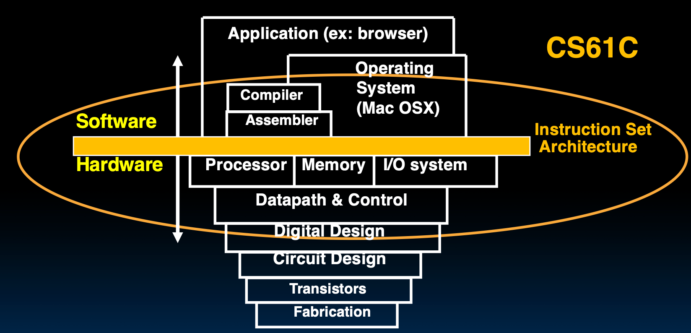

## 运算器

主要关心整数运算器，设计 ALU (Arithmetic Logic Unit)。

ALU 负责执行所有的算术和逻辑操作，比如加法、减法、按位与、按位或等。

**饱和运算 Saturating operations**：如果结果超出范围，就取最大值或最小值。

### 乘法

RISC-V 的乘法有四个指令：

- `mul`：乘法，返回低 32 位。
- `mulh`：乘法，返回高 32 位（有符号数）。
- `mulhu`：乘法，返回高 32 位（无符号数）。
- `mulhsu`：乘法，返回高 32 位（有符号数和无符号数混合相乘）。

**Faster Multiplication 阵列乘法器**：TODO。

### 浮点数加法

1. 对齐指数部分，将小的指数部分右移，直到两个指数相等。
2. 有效位部分相加，此处不判断溢出。
3. 规格化，调整有效位和指数部分。
4. 判断指数的溢出。
5. 舍入。

用流水线技术提高速度。

## 浮点数寄存器

RISC-V 有 32 个浮点数寄存器，命名为 `f0` 到 `f31`。

每个寄存器都是 64 位，若要存储 32 位浮点数，则低 32 位存储数据，高 32 位置零。

