[toc]

Chapter 4: The Processor

本章目标：用硬件描述语言设计一个 Single-Core Processor。

本章将实现支持七条指令的处理器设计：

- Memory：lw, sw.
- Arithmetic：add, sub, and, or.
- Conditional branch：beq.

**单周期处理器**： **所有指令都在一个时钟周期内完成。**

CPU 有两部分组成：DataPath 数据通路和 ControlPath 控制通路。

功能部件分为：组合逻辑部件和时序部件（状态部件）。

## Instruction Execution

1. 取指，**同时进行**两步：
    - 把 PC 的值送给指令存储器，指令存储器从内存取出指令。
    - $\text{PC}\leftarrow \text{PC}+4$.
2. 译码：
    - **取指令的操作码**，生成控制信号。
    - 根据指令类型，按照规则，**取操作数**。
3. 执行。

## Components

用低电平表示 0，用高电平表示 1。

一根导线只可以传输一个 0 或 1。

### 组合逻辑部件

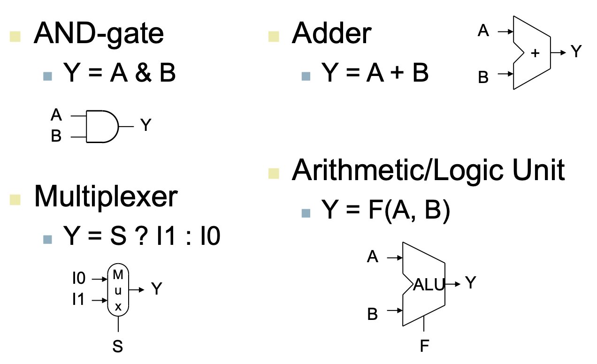

### 时序部件

**Edge-triggered**：每个周期有两个边缘，只有在上升沿或下降沿时，才把输入的数据送到输出端。

**Register**：

- 在回路中存储数据。
- 有一个信号 $\text{Write}$，表示是否把输入端的数据送到输出端：
    - $\overline{\text{Write}}$ 或者 $\text{Write}^{\#}$ 表示低电平有效，其余情况为高电平有效。
    - 常见表示为 $R/\overline W$，含义为高电平读，低电平写。

**Clocking Methodology**：

组合逻辑部件在时钟周期之间处理数据输入：

- 在下一个时钟沿到来之前将输出准备好。
- 从状态部件读取数据，经过组合逻辑部件处理后，送到另一个状态部件。
- 这个过程发生在时钟周期之间。

---

## DataPath

### Fetch Instruction

同时进行两步：

- 把 PC 的值送给指令存储器，指令存储器从内存取出指令。
- $\text{PC}\leftarrow \text{PC}+4$.

需要的部件：adder，寄存器 PC，Instruction memory。

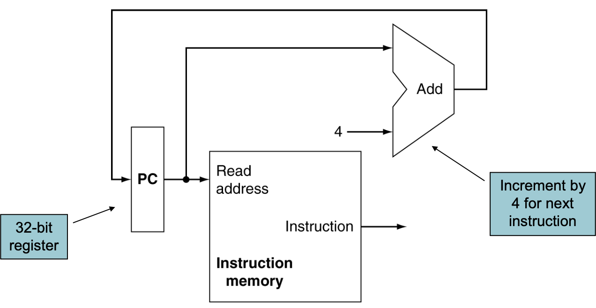

由于这些部件都在单周期内完成，所以可以同时进行两个操作。

### R-format Instructions

R-format：`add x5, x6, x7`.

**需要的部件**：寄存器堆 RF，ALU。

**步骤**：

- **读寄存器**——操作数给 RF，取出两个寄存器的值；
- **计算**——送到 ALU 进行计算；
- **写寄存器**——操作数给 RF，指定 RF 的 Write 信号为高电平，把 ALU 的输出送回到 RF 中。

**示意图**：

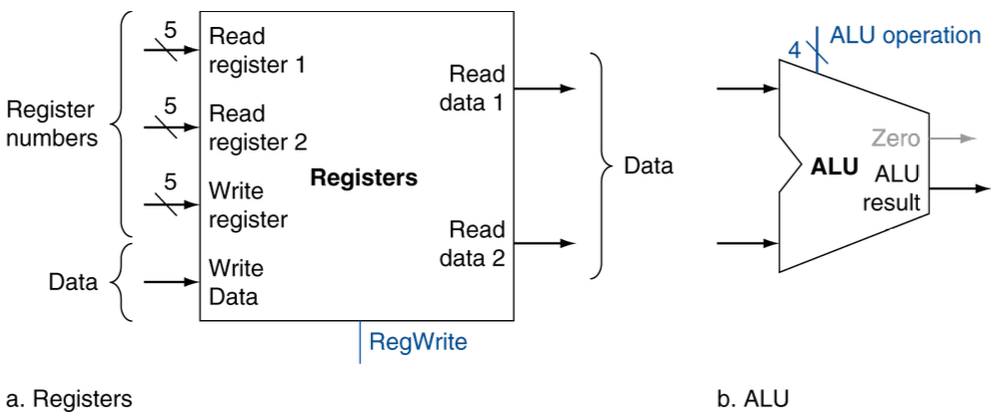

### Load Instructions

Load：`lw x5, 3(x6)`.

**需要的部件**：Imm Generator，ALU，Memory，寄存器堆 RF。

**Imm Generator**：把立即数部分取出，进行符号扩展，以匹配 32 位。

**步骤**：

- **计算地址**：
    - 从 RF 中**取出寄存器的值**（并行）；
    - 立即数通过 Imm Gen 进行 **sign-extend** 后送到 ALU（并行）；
- **读 Memory**：把刚才计算得到地址给 Memory
- **取值**：从 Memory 读，调整 Memory 的 Read 信号为高电平，得到的值送到 RF 中。

**示意图**：

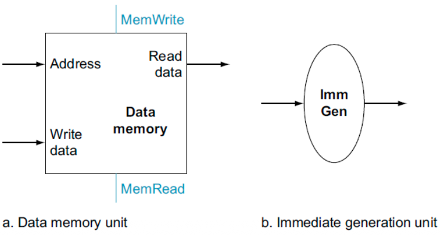

### Store Instruction

Store：`sw x5, 3(x6)`.

**步骤**：与 Load 类似，计算地址部分完全相同。

- **计算地址**：
    - 从 RF 中**取出寄存器的值**（并行）；
    - 立即数通过 Imm Gen 进行 **sign-extend** 后送到 ALU（并行）；
- **写 Memory**：把刚才计算得到地址给 Memory，调整 Memory 的 Write 信号为高电平，把 RF 中的值送到 Memory。

### Branch Instruction

Branch：`beq x5, x6, label`.

**需要的部件**：Imm Generator，ALU，寄存器堆 RF，PC，额外的 adder。

**步骤**：

- **读 RF**：从 RF 中取出两个寄存器的值；
- **计算比较**（并行）：用 ALU 进行减法运算，判断是否相等；
- **计算分支地址**（并行）：
    - 立即数通过 Imm Gen 进行 **sign-extend**，之后**左移一位**，算出 PC + Imm；
    - 注意是 PC + Imm，不是 (PC + 4) + Imm，即当前正在运行的指令的地址，把这个本周期最开始的值送到 adder，详见最后的 Full Datapath 图。
    - 注意这需要额外的 adder，不能与 PC = PC + 4 的 adder 共用，因为这个分支有两种情况，要提前算出来 PC+4 和 PC+Imm 两种情况。
- **写 PC**：
    - 如果 ALU 的 Zero 信号为高电平，表示相等，把 PC + Imm 送到 PC；
    - 否则，把 PC + 4 送到 PC。

**示意图**：

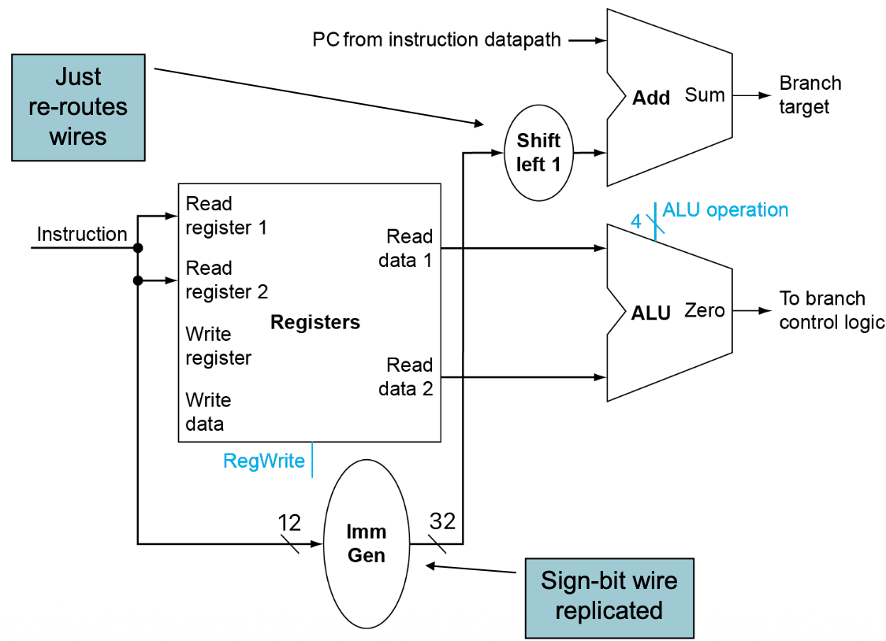

### Full DataPath

综上所述，可能同一个输入，需要支持多种来源的信号，因此还需要补充 **MUX 多路选择器**。

比如 ALU 的第二个输入：

- 可能是立即数 Imm：Load / Store 指令计算地址。

- 也可能是寄存器的值： Branch 指令。

**示意图**：

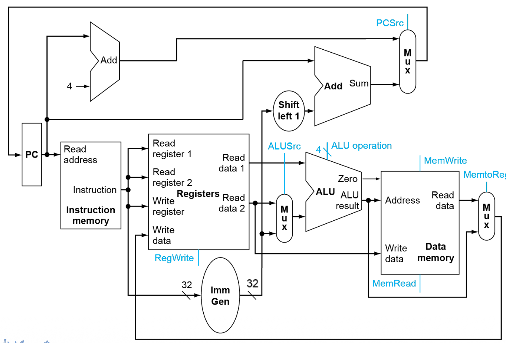

---

## Control

图中蓝色的信号是控制信号。

其中 **PCSrc** 控制信号比较特殊：只有当前指令是 Branch 并且 ALU 的 Zero=1 时，才把 PC + Imm 送到 PC，否则都送 PC + 4。

上述的 Branch 信号需要依赖 Control Path 生成。

其余**控制信号由 Control Path 生成**，下面具体说明。

### ALU Control

ALU 需要负责多种指令，对应不同的控制信号：

- R-format 指令：`add, sub, and, or`，需要 4 种控制信号。
- Load / Store： `add`。
- Branch： `sub`。

Control Path 根据指令的 op, func3, func7 字段生成 ALU 的控制信号。

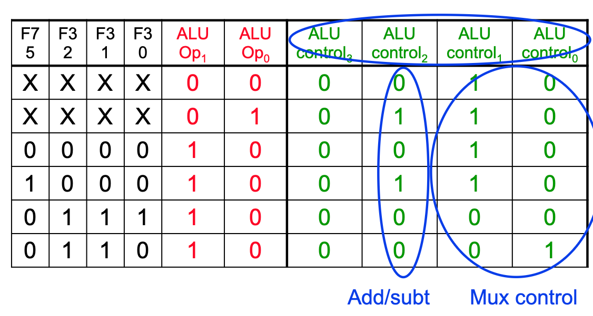

真值表允许出现：$0, 1, \text{X}$ 三种状态，其中 $\text{X}$ 表示“无关（don't care）”；高阻态通常记为 $\text{Z}$。

### Control Unit

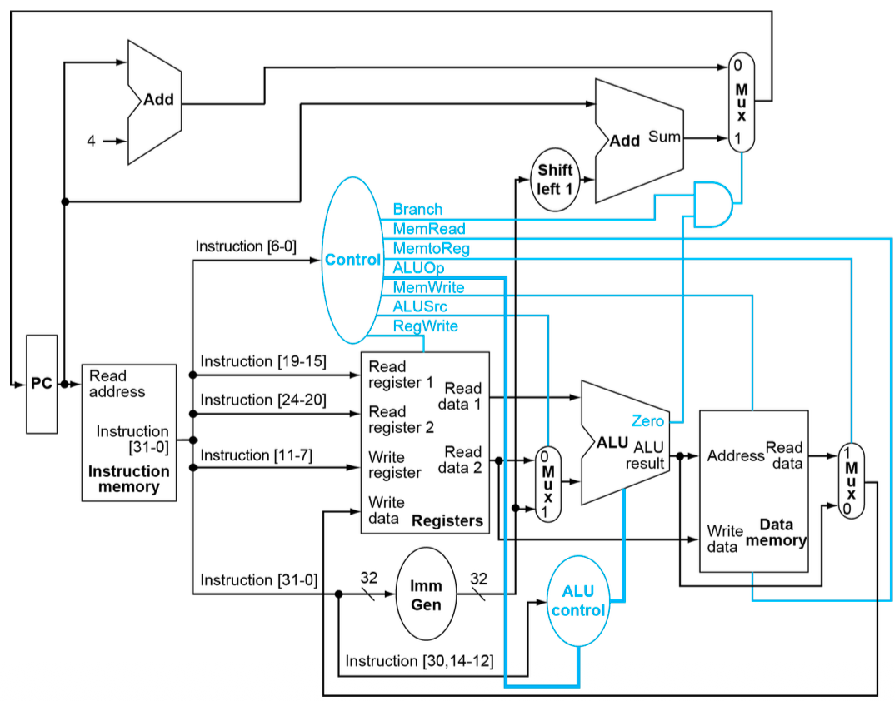

在 ALU Control 之外，Control Path 还需要根据 op 部分，生成以下控制信号：

- Branch：是否为 beq 指令。
- MemRead：是否读内存。
- MemtoReg： 内存读出的值是否写回寄存器。
- ALUop：ALU Control 所需的操作码。
- MemWrite：是否写内存。
- ALUSrc：选择 ALU 第二个输入。
- RegWrite：是否写寄存器。

### Control Unit Implementation

有两种控制器实现方式。

一般情况下，简单指令用组合逻辑实现，复杂指令用存储器实现。

#### Combinational Logic Control

组合逻辑控制器。

根据上述逻辑，列出真值表，用组合逻辑实现。

输入 Inst[6:0]，经过组合逻辑，输出各个控制信号。

#### ROM-based Control

存储型控制器 / 微程序控制器。

对于 RISC-V 这种精简指令集，组合逻辑实现足够快，复杂性可控制。而对于 x86 等复杂指令集，组合逻辑实现会非常复杂，不太稳定。

为了简化设计，可以用 Read-Only Memory, ROM 来实现 Control Path。

ROM 中，每一行是一个存储单元，对应一个**微指令**：

- 地址是指令的 op 部分；
- 内容是控制信号，每一位对应一个信号。

一条复杂的指令可能需要多条微指令来完成，称为**微程序**。

使用时，用指令的 op 部分，作为地址，从 ROM 中取出对应的控制信号。

## 补充指令

### JAL Instruction 

JAL：`jal rd, Imm`。

**步骤**：

- 取指
- 计算地址：
    - 把立即数通过 Imm Gen 符号扩展，之后左移一位，之后计算 PC + Imm；
    - 计算 PC + 4
- 把 PC + Imm 写回 PC，把 PC + 4 写回寄存器 rd。

**Data / Control Flow**：

- 为了把 `PC + Imm` 送到 PC，需要对右上角的 Mux 增加 `PCSrc` 信号（与分支控制组合），在需要跳转时选择 `PC + Imm`。

- 为了把 `PC + 4` 写回寄存器 `rd`（常用作链接寄存器 x1），需要在 WB 端扩展写回选择：
  - 将 `MemtoReg` 扩展为两位的选择信号，例如 `00: ALUOut, 01: ReadData, 10: PC+4`（也可命名为 `ResultSrc/WBSel`）。
  - `RegWrite=1` 时写回 `rd`。

### JALR Instruction

JALR：`jalr rd, rs1, Imm`

**步骤**：

- 取指
- 计算地址：
    - 取寄存器 rs1，把立即数通过 Imm Gen 符号扩展，计算 rs1 + Imm
    - 计算 PC + 4
- 把 rs1 + Imm 写回 PC，把 PC + 4 写回寄存器 rd。

设计图和真值表如下。

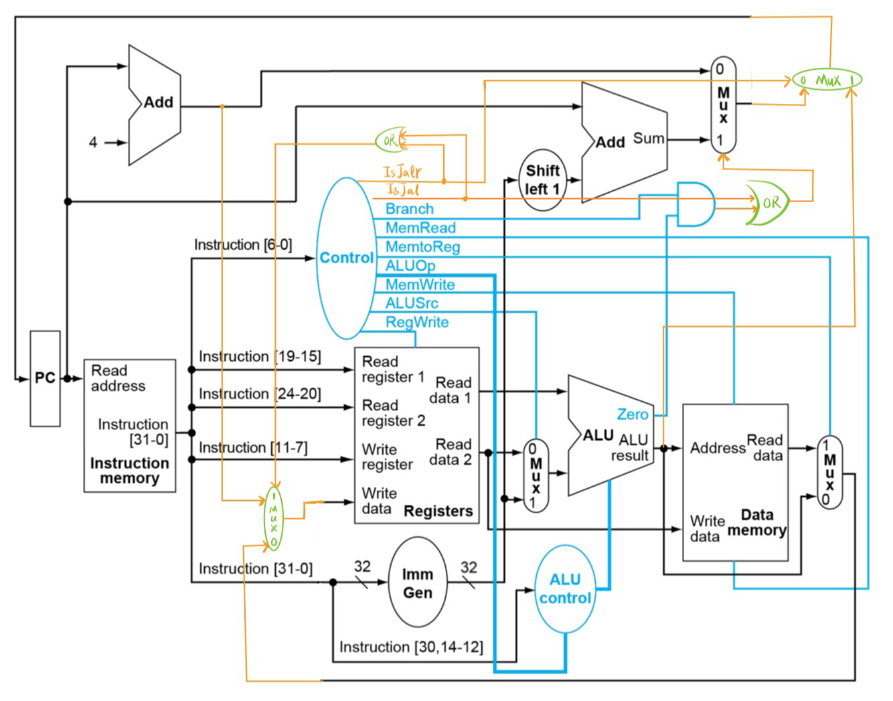

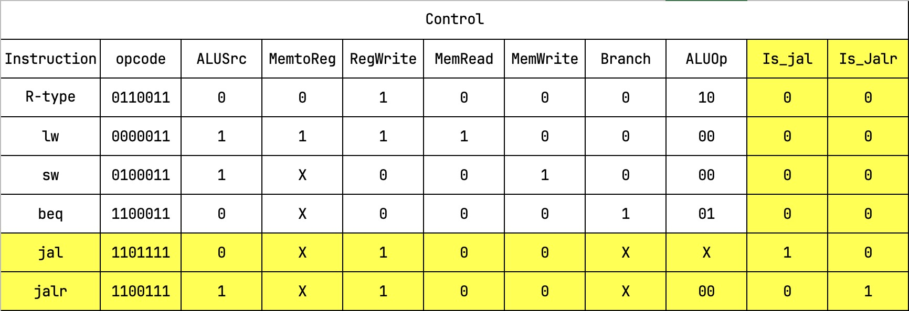

### ORI Instruction

I-type：`ori rd, rs1, imm`。对 `rs1` 与有符号扩展后的 `imm` 做按位或，结果写回 `rd`。

控制要点：
- `RegWrite = 1`
- `ALUSrc = 1`（ALU 第二个输入选立即数）
- `ALUCtrl = OR`
- `MemRead = 0`, `MemWrite = 0`, `MemtoReg = 0`（WB 选 ALU 结果）

示例：`ori x5, x3, 0x0FF` 将 `x3` 与 `0x0FF` 做 OR，结果写入 `x5`。

## Performance

为了衡量性能，需要计算**各指令的延迟路径与总延迟**。

CPU 时钟周期由**最长的延迟路径**决定，关键路径决定：更短的指令也需要等待这个最长指令完成后，才能进入下一个周期。

计算指令的延迟路径，常常忽略 MUX, Control Unit, PC 等延迟较小的部件。之后根据并行和串行的关系，计算各个指令的延迟路径。

后序会介绍**流水线**，可以提升性能。

## Multicycle

多周期处理器：**每条指令分多个时钟周期完成**。

把每条指令分成多个 step，每个 step 在一个时钟周期内完成。这样可以增加主频，CPI 增大。

这样可以让较短的指令执行更快，因为不需要等待最长指令完成，但还是串行执行每条指令。

### Datapath

由于每个时钟周期结束后，指令可能并没有结束，因此每个 unit 的输出值需要**存储在寄存器**中，供下一个周期继续执行这条指令的后续 step 使用，包括：
- IR：Instruction Register，存储当前指令。
- A, B：存储从寄存器堆读出的两个寄存器
- MDR：Memory Data Register，存储从内存读出的数据
- ALUOut：存储 ALU 的输出

另外，由于每个周期只执行一个 step，因此原来有很多部件是多余的，可以只保留一份。比如 Instruction Memory 和 Data Memory 可以合并成一个 Memory；Adder 和 ALU 也可以合并成一个 ALU。

简略的 Datapath 示意图如下。

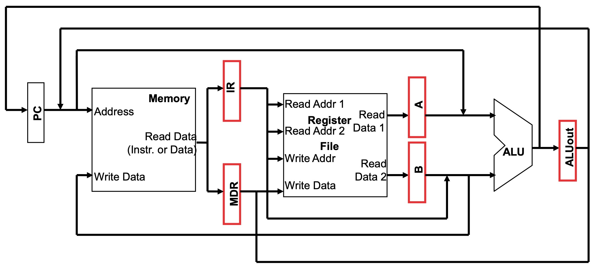

### Control

当然多周期也需要 Control Path 来生成控制信号，所需要的控制信号类别不变，而每个指令的每个 step 都需要不同的控制信号。

因此需要引入**时序信号**，表示当前处于哪个 step，由**状态机**生成对应的控制信号。

状态机是一个**有限状态机**，每个状态对应一个 step。输入操作码和时钟信号，输出当前 step 所需的控制信号。

## Pipeline

在 Multicycle 的基础上，Pipeline 技术能让 **多个指令同时执行**。

流水线的核心思想是 **把指令的执行过程拆分成多个阶段**，从而让不同指令的不同阶段可以 **并行执行**。

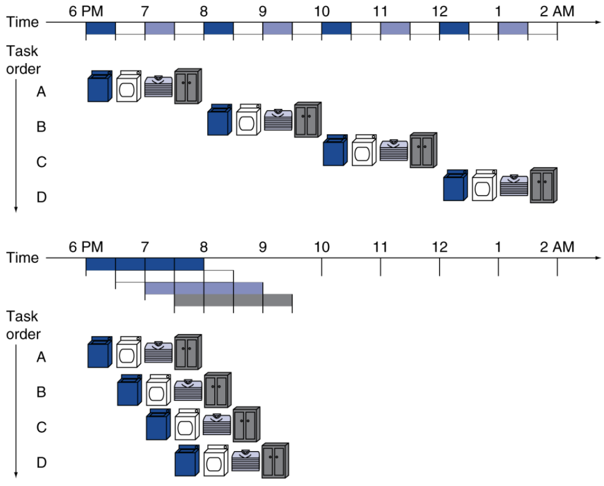

可以看到，对于中间的周期，每个周期都能完成一条指令的执行。

### RISC-V Pipeline

RISC-V 指令被拆分成五个阶段，每个阶段对应一个时钟周期：

1. IF：Instruction Fetch，取指令
2. ID：Instruction Decode，译码 & 读寄存器
3. EX：Instruction Execute，执行操作 或 计算地址
4. MEM：Memory Access，访存
5. WB：Write Back，写回寄存器

这被称为 5-stage Pipeline 五级流水线。如果 $5$ 个阶段延迟相等，则：

$$
\text{Execution Time}_{\text{pipelined}}=\frac{\text{Execution Time}_{\text{non-pipeline}}}{5}
$$

然而需要注意，**单个指令的 Latency 并没有减少**，而且与单周期对比，由于必须经过五级，单个指令的延迟反而增加了。

之所以能加速，主要是因为 **Throughput 吞吐量** 的提升，也就是 **单位时间内完成的指令数** 增加了。

> **单发射和双发射**：单发射指每个时钟周期只能发射一条指令，而双发射指每个时钟周期可以发射两条指令。双发射可以进一步提高吞吐量，但需要更复杂的硬件支持。

流水线的实现与 Multicycle 类似，也需要在每个阶段之间增加**Pipeline registers 流水线寄存器**，其命名比较统一：IF/ID、ID/EX、EX/MEM、MEM/WB，分别存储每个阶段的输出，供下一个阶段使用。

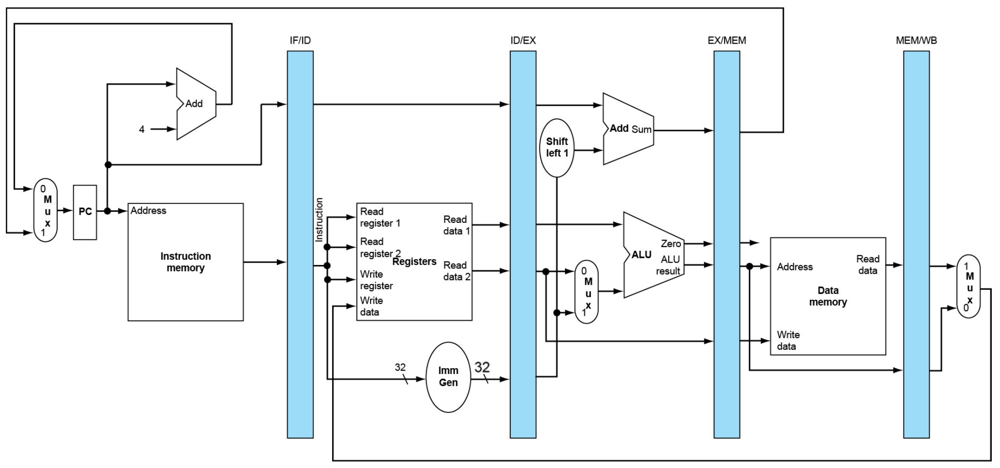

然而，现有五级流水线图还缺少“写回路径与目的寄存器 rd 的逐级保留”，导致 WB 阶段无法把结果写回寄存器堆。

WB 需要写回目的寄存器号 `rd` 和写回数据，所以前者需要 **逐级保留** 于每个 Pipeline Register。

这并不涉及 Structure Hazards，因为 RegisterFile 的 Read / Write 都很快，一个周期内可以同时完成 Read 和 Write。所以虽然有多个阶段争用一个硬件资源，但是并不冲突。

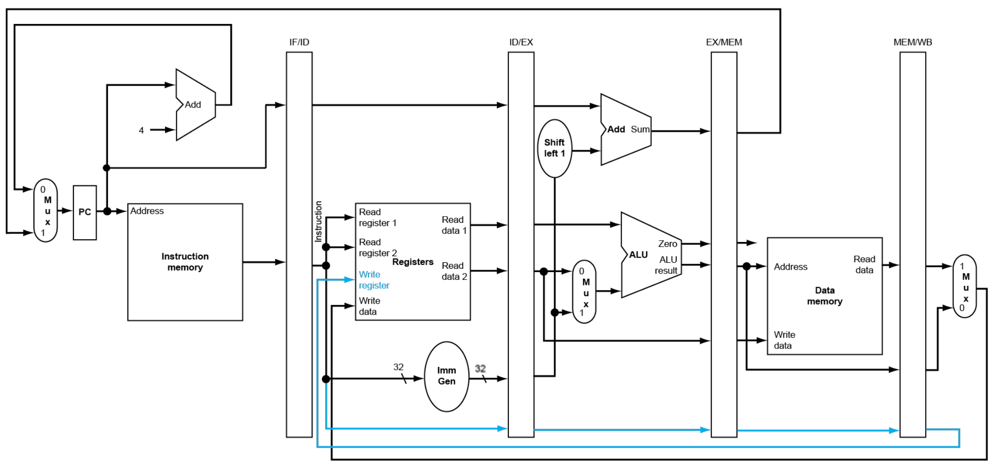
## Pipeline Hazards

上述流水线的并行执行会引入**冒险 Hazards**，主要有三种类型。

### Structure Hazards

**现象**：同一周期多个阶段**争用同一硬件资源**，所以这个问题通常都需要在设计结构的时候解决。

**解决方法**：增加新的部件，或者流水线阻塞（等着上一条指令结束占用）。

### Data Hazards

#### R-format Instruction

**现象**：`add x3, x1, x2` 结束后，才有 `x3` 的结果，才能执行 `sub x5, x3, x4`。

正常情况下，需要等五个周期全结束，WB 后，才能取得 x3 的数据。然而这样的话，Pipeline 完全没有并行，效率很低。这种现象叫做 **Pipeline Bubble**.

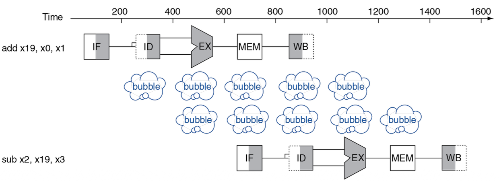

而之所以只需要 bubble 两个周期，是因为前半个周期完成 WB，后半个周期完成 ID，这是 RF 的特性造成的：*RF 用下降沿 Write（前半个周期），用后半个周期 Read*；其余周期都是在上升沿 Write。

**解决方法：Forwarding / Bypassing**。

如图所示，直接增加从 **EX旁路**——EX/MEM.ALUOut -> ALU.in 的数据通路，无需等待结果被 WB 到寄存器。

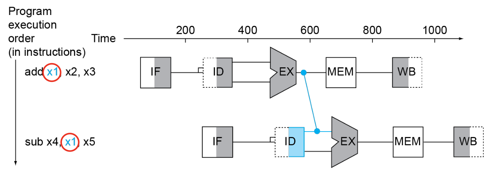

#### Load Instruction

**现象：** `lw  x7, 0(x3)` 结束后，才有 `x7` 的结果，才能运行 `add x8, x7, x9`。
load 指令的数据在 MEM 阶段末尾才可用，紧随其后的指令在 EX 阶段就需要该数据。

**解决方法**：增加 **MEM 旁路**，如图所示，但是由于 load 指令与 R-format 指令不同，Pipeline 不得不阻塞一个周期。

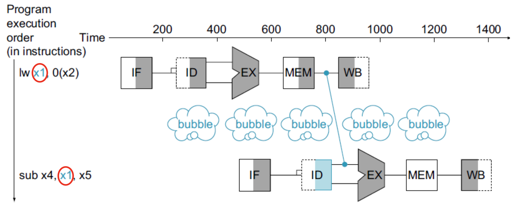

#### Code Scheduling

这是另一种在某些情况有用的解决方法。编译器自动给汇编指令调整顺序，来避免 Data Hazards。如图所示，是 C 代码 `a = b + e; c = b + f;` 的两种实现，右侧的就可以避免 Hazards。

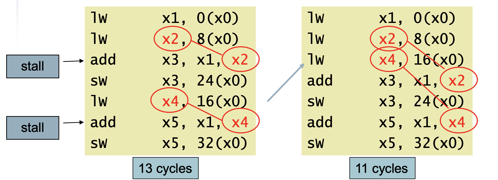
### Control Hazards

**现象**：对于 Branch 指令 `beq x5, x0, L1`，需要第三个周期结束，才能知道跳转到哪里。这几个周期中间会出现 Bubble。

**解决方法**：
- 阻塞
- **Branch Prediction 分支预测**，分为静态预测 和 动态预测算法。

#### Branch Prediction

TODO。

## Pipeline Operation
### DataPath

Datapath的分析有两种画图方法：

**Single-Cycle Pipeline Diagram**：TODO

**Multi-Cycle Pipeline Diagram**：TODO

### Control

TODO