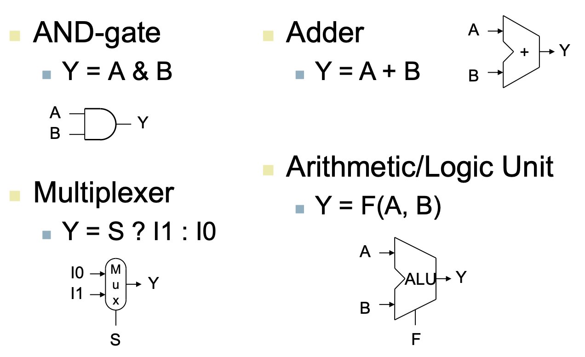
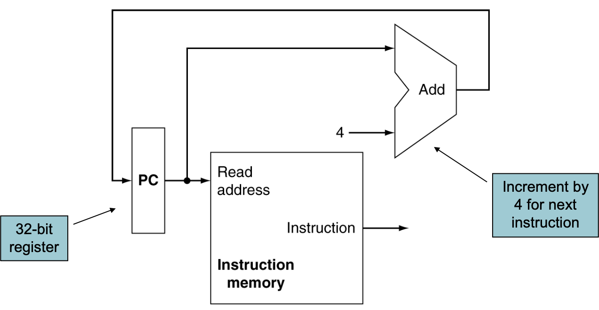
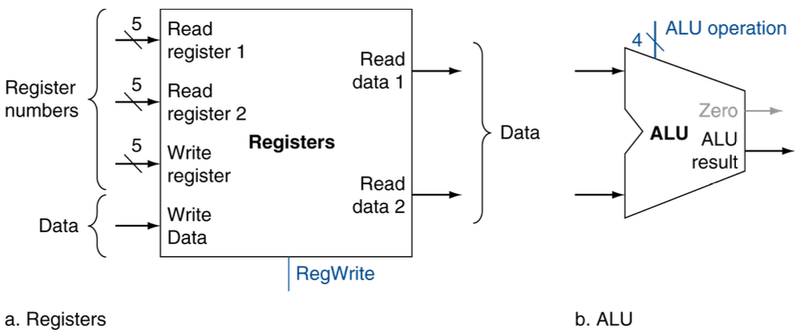
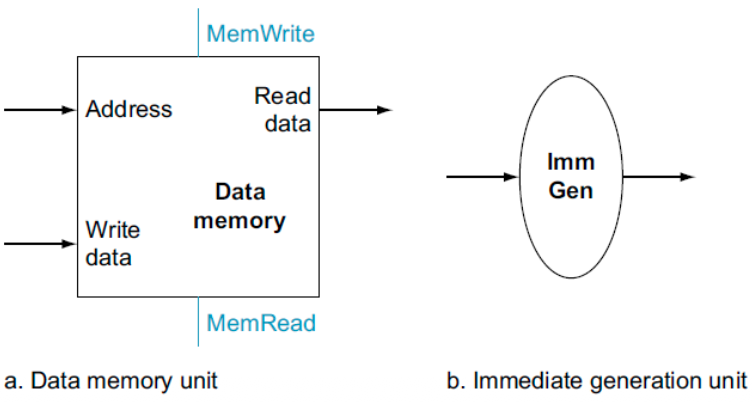
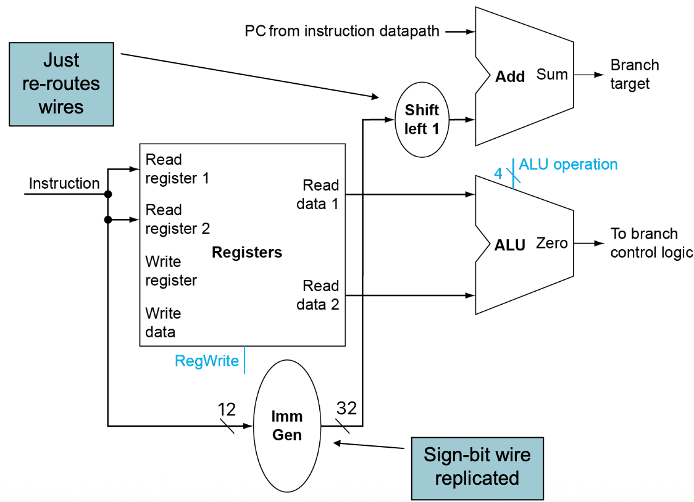
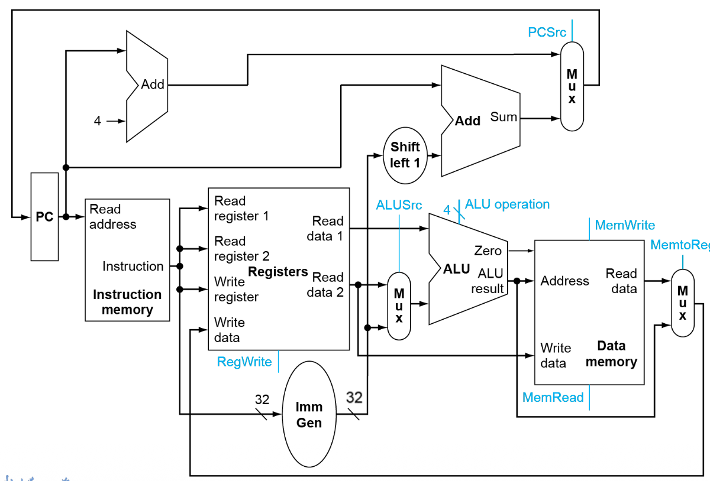
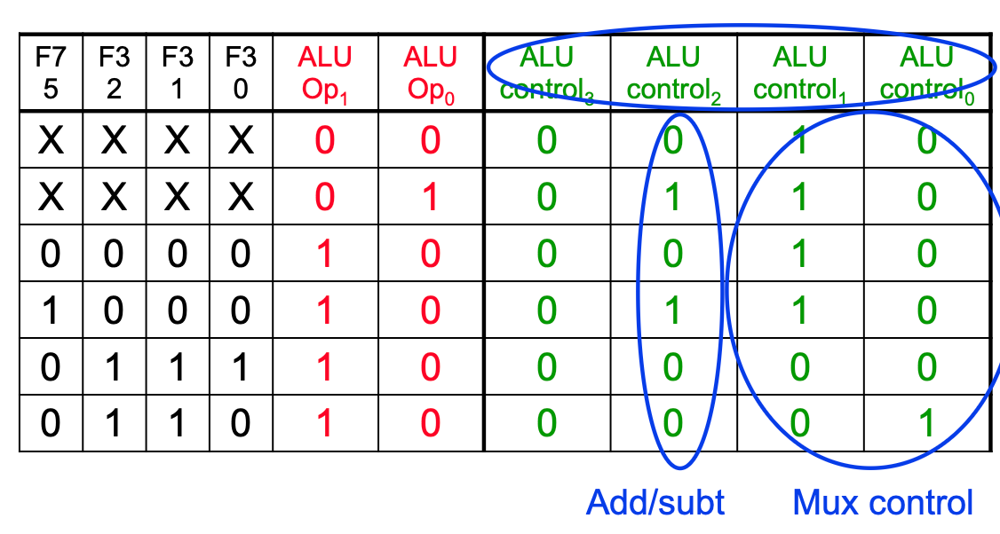
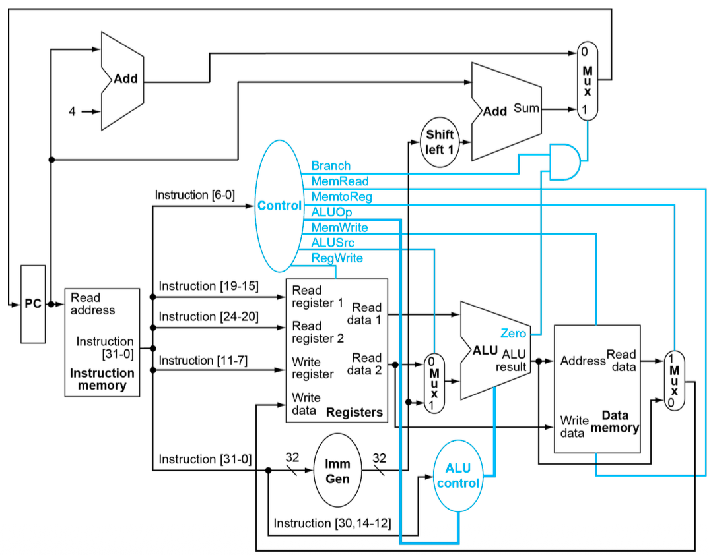
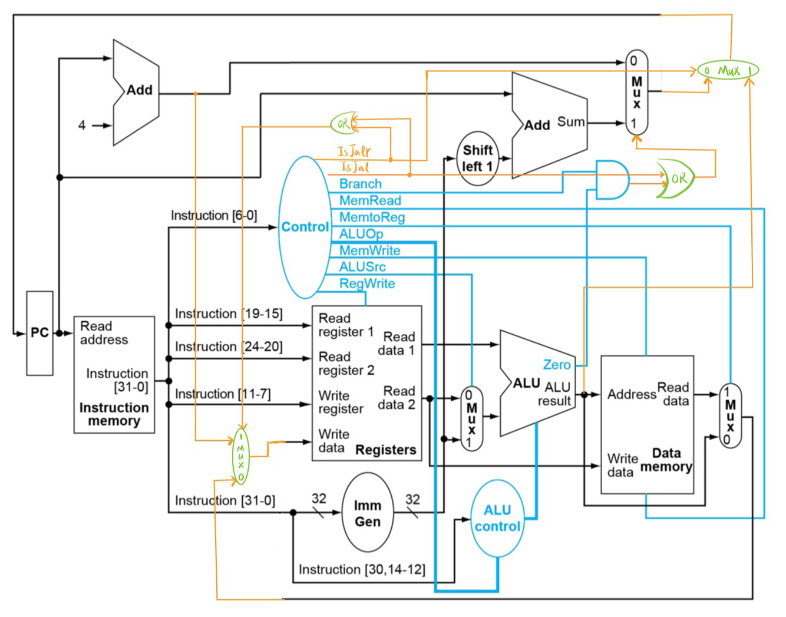
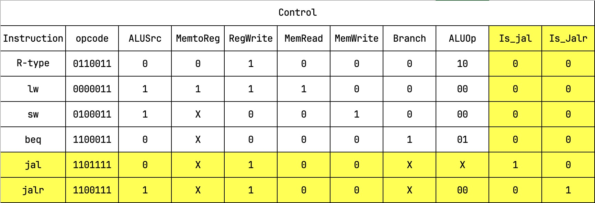

[toc]

Chapter 4: The Processor

本章目标：用硬件描述语言设计一个 Single-Core Processor。

本章将实现支持七条指令的处理器设计：

- Memory：lw, sw.
- Arithmetic：add, sub, and, or.
- Conditional branch：beq.

**单周期处理器**：**所有指令都在一个时钟周期内完成。**

CPU 有两部分组成：DataPath 数据通路和 ControlPath 控制通路。

功能部件分为：组合逻辑部件和时序部件（状态部件）。

## 指令的执行

1. 取指，**同时进行**两步：
    - 把 PC 的值送给指令存储器，指令存储器从内存取出指令。
    - $\text{PC}\leftarrow \text{PC}+4$.
2. 译码：
    - **取指令的操作码**，生成控制信号。
    - 根据指令类型，按照规则，**取操作数**。
3. 执行。

## Components

用低电平表示 0，用高电平表示 1。

一根导线只可以传输一个 0 或 1。

### 组合逻辑部件

### 时序部件

**Edge-triggered**：每个周期有两个边缘，只有在上升沿或下降沿时，才把输入的数据送到输出端。

**Register：**

- 在回路中存储数据。
- 有一个信号 $\text{Write}$，表示是否把输入端的数据送到输出端：
    - $\overline{\text{Write}}$ 或者 $\text{Write}^{\#}$ 表示低电平有效，其余情况为高电平有效。
    - 常见表示为 $R/\overline W$，含义为高电平读，低电平写。

**Clocking Methodology**：

组合逻辑部件在时钟周期之间处理数据输入：

- 在下一个时钟沿到来之前将输出准备好。
- 从状态部件读取数据，经过组合逻辑部件处理后，送到另一个状态部件。
- 这个过程发生在时钟周期之间。

---

## DataPath

### Fetch Instruction

同时进行两步：

- 把 PC 的值送给指令存储器，指令存储器从内存取出指令。
- $\text{PC}\leftarrow \text{PC}+4$.

需要的部件：adder，寄存器 PC，Intruction memory。

由于这些部件都在单周期内完成，所以可以同时现两个操作。

### R-format Instructions

R-format：`add x5, x6, x7`.

**需要的部件：**寄存器堆 RF，ALU。

**步骤：**

- **读寄存器**——操作数给 RF，取出两个寄存器的值；
- **计算**——送到 ALU 进行计算；
- **写寄存器**——操作数给 RF，指定 RF 的 Write 信号为高电平，把 ALU 的输出送回到 RF 中。

**示意图：**

### Load Instructions

Load：`lw x5, 3(x6)`.

**需要的部件**：Imm Generator，ALU，Memory，寄存器堆 RF。

**Imm Generator**：把立即数部分取出，进行符号扩展，以匹配 32 位。

**步骤：**

- **计算地址**：
    - 从 RF 中**取出寄存器的值**（并行）；
    - 立即数通过 Imm Gen 进行 **sign-extend** 后送到 ALU（并行）；
- **读 Memory**：把刚才计算得到地址给 Memory
- **取值：**从 Memory 读，调整 Memory 的 Read 信号为高电平，得到的值送到 RF 中。

**示意图：**

### Store Instruction

Store：`sw x5, 3(x6)`.

**步骤：**与 Load 类似，计算地址部分完全相同。

- **计算地址**：
    - 从 RF 中**取出寄存器的值**（并行）；
    - 立即数通过 Imm Gen 进行 **sign-extend** 后送到 ALU（并行）；
- **写 Memory**：把刚才计算得到地址给 Memory，调整 Memory 的 Write 信号为高电平，把 RF 中的值送到 Memory。

### Branch Instruction

Branch：`beq x5, x6, label`.

**需要的部件：**Imm Generator，ALU，寄存器堆 RF，PC，额外的 adder。

**步骤：**

- **读 RF**：从 RF 中取出两个寄存器的值；
- **计算比较**（并行）：用 ALU 进行减法运算，判断是否相等；
- **计算分支地址**（并行）：
    - 立即数通过 Imm Gen 进行 **sign-extend**，之后**左移一位**，算出 PC + Imm；
    - 注意是 PC + Imm，不是 (PC + 4) + Imm，即当前正在运行的指令的地址，把这个本周期最开始的值送到 adder，详见最后的 Full Datapath 图。
    - 注意这需要额外的 adder，不能与 PC = PC + 4 的 adder 共用，因为这个分支有两种情况，要提前算出来 PC+4 和 PC+Imm 两种情况。
- **写 PC**：
    - 如果 ALU 的 Zero 信号为高电平，表示相等，把 PC + Imm 送到 PC；
    - 否则，把 PC + 4 送到 PC。

**示意图**：

### Full DataPath

综上所述，可能同一个输入，需要支持多种来源的信号，因此还需要补充 **MUX 多路选择器**。

比如 ALU 的第二个输入：

- 可能是立即数 Imm：Load / Store 指令计算地址。

- 也可能是寄存器的值： Branch 指令。

**示意图**：

---

## Control

图中蓝色的信号是控制信号。

其中 **PCSrc** 控制信号比较特殊：只有当前指令是 Branch 并且 ALU 的 Zero=1 时，才把 PC + Imm 送到 PC，否则都送 PC + 4。

上述的 Branch 信号需要依赖 Control Path 生成。

其余**控制信号由 Control Path 生成**，下面具体说明。

### ALU Control

ALU 需要负责多种指令，对应不同的控制信号：

- R-format 指令：`add, sub, and, or`，需要 4 种控制信号。
- Load / Store： `add`。
- Branch： `sub`。

Control Path 根据指令的 op, func3, func7 字段生成 ALU 的控制信号。

真值表允许出现：$0, 1, \text{X}$ 三种状态，其中 $\text{X}$ 是高阻态，表示不关心。

### Control Unit

在 ALU Control 之外，Control Path 还需要根据 op 部分，生成以下控制信号：

- Branch：是否为 beq 指令。
- MemRead：是否读内存。
- MemtoReg： 内存读出的值是否写回寄存器。
- ALUop：ALU Control 所需的操作码。
- MemWrite：是否写内存。
- ALUSrc：选择 ALU 第二个输入。
- RegWrite：是否写寄存器。

### Control Unit Implementation

有两种控制器实现方式。

一般情况下，简单指令用组合逻辑实现，复杂指令用存储器实现。

#### Combinational Logic Control

组合逻辑控制器。

根据上述逻辑，列出真值表，用组合逻辑实现。

输入 Inst[6:0]，经过组合逻辑，输出各个控制信号。

#### ROM-based Control

存储型控制器 / 微程序控制器。

对于 RISC-V 这种精简指令集，组合逻辑实现足够快，复杂性可控制。而对于 x86 等复杂指令集，组合逻辑实现会非常复杂，不太稳定。

为了简化设计，可以用 Read-Only Memory, ROM 来实现 Control Path。

ROM 中，每一行是一个存储单元，对应一个**微指令**：

- 地址是指令的 op 部分；
- 内容是控制信号，每一位对应一个信号。

一条复杂的指令可能需要多条微指令来完成，称为**微程序**。

使用时，用指令的 op 部分，作为地址，从 ROM 中取出对应的控制信号。

## 补充指令

### JAL Instruction 

JAL：`jal rd, Imm`。

**步骤：**

- 取指
- 计算地址：
    - 把立即数通过 Imm Gen 符号扩展，之后左移一位，之后计算 PC + Imm；
    - 计算 PC + 4
- 把 PC + Imm 写回 PC，把 PC + 4 写回寄存器 rd。

**Data / Control Flow**：

- 为了把 PC + Imm 送到 PC，因此需要对右上角的 Mux 进行修改——增加一个 PCSrc 信号，配合 OR 门，强制 Mux 选择 PC + Imm。

- 为了把 PC + 4 写回寄存器 x1，因此需要对寄存器堆 RF 进行修改——增加一个 Mux，选择写回寄存器的值是 ALU 的输出，还是 PC + 4。Mux 由新增信号 RegDst 控制。当然，也可以把 Mux 换成一个三选一的 Mux，不过不影响控制信号的数量，仍然需要一个 RegDst 信号。

### JALR Instruction

JALR：`jalr rd, rs1, Imm`

**步骤**：

- 取指
- 计算地址：
    - 取寄存器 rs1，把立即数通过 Imm Gen 符号扩展，计算 rs1 + Imm
    - 计算 PC + 4
- 把 rs1 + Imm 写回 PC，把 PC + 4 写回寄存器 rd。

设计图和真值表如下。

### ORi Instruction

补充一个与立即数有关的指令。

## Performance

为了衡量性能，需要计算**各指令的延迟路径与总延迟**。

CPU 时钟周期由**最长的延迟路径**决定，关键路径决定：更短的指令也需要等待这个最长指令完成后，才能进入下一个周期。

计算指令的延迟路径，常常忽略 MUX, Control Unit, PC 等延迟较小的部件。之后根据并行和串行的关系，计算各个指令的延迟路径。

后序会介绍**流水线**，把各个指令的执行过程拆分成多个阶段，让不同指令的不同阶段可以并行执行，从而提升性能。
