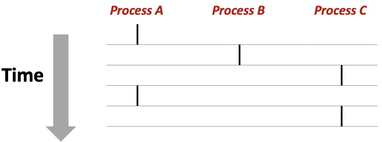
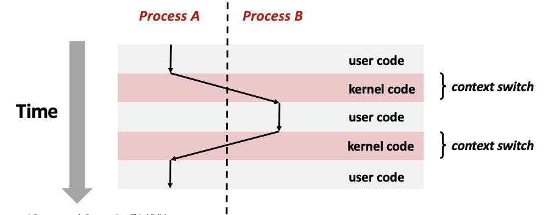

Exceptional Control Flow: Exceptions and Processes

在之前的学习主要关注静态代码，直到加载程序。而本章开始关注动态的过程，讨论程序执行的具体动态过程。

这章对应的 Lab 是 Shell Lab.

## Exceptional Control Flow

正常情况下，程序的控制流是线性的，顺序执行。CPU 朴素地从指令序列上读取并依次执行。

而我们知道，在实际的程序中，控制流并不是线性的，称为异常控制流，分为两个层面的状态：

- 程序状态 Program state
    - 条件跳转 Jumps and branches
    - 函数调用 Call and return
- 系统状态 System state
    - 比如键盘按 `Ctrl-C`，除零等等。

在实际的程序中，控制流的改变是非常复杂的，统称为 **Exceptional Control Flow 异常控制流**。

### 不同层级上的机制

- **Low level mechanisms：**
    - **「Exceptions 异常」** 系统层面，需要硬件和操作系统一起解决。
- **Higher level machinisms：**
    - **「Process context switch 进程切换」** 需要操作系统 + 硬件计时器；
    - **「Signals 信号」** 需要操作系统；
    - **「Nonlocal jumps 非本地跳转」** 需要 C runtime library 实现，如 *`setjmp`* 和 *`longjmp`* 函数配合使用，实现局部函数调用栈以外的异常跳转，属于用户级控制流转变机制。

## Exceptions

这是异常控制流的最底层机制，异常是由 CPU 触发的，通常是由于硬件错误或者系统调用引起的。

对于不同的异常，有一个独立的异常号，与对应的异常处理程序的地址一起，对应存储在 **「Exception Tables」** 中，非常类似于跳转表。这个表的起始地址会存储在一个 CPU 的特殊寄存器中。但是好像在不同的系统中有不同实现。

系统在发现异常后，会根据 Exception Tables，转到操作系统中对应的异常处理程序，并执行不同操作。

异常有很多种类型，下面介绍一些类型的异常及处理程序。

### Interrupts 

中断，Asynchronous Exceptions.

由处理器连接的外部设备引起的异常，比如键盘、鼠标、网络等。

CPU 会在当前指令完成后，再处理外部异常，之后回到原来的指令的下一条继续执行。

### Synchronous Exceptions

简称异常，是 CPU 内部的异常，细分为以下类别：

- **Traps**
    - Intentional，由程序员主动引起的异常；
    - 比如 **system calls**，breakpoint 等等。
    - 可以在处理结束后，从原来的下一条指令继续执行。
- **Faults**
    - Unintentional，部分 recoverable ；
    - 这里 recoverable 的含义是：**内核** 能否让同一指令重新尝试，也就是有可能可以通过重复程序恢复的。
    - 比如 page faults (recoverable)，protection faults (unrecoverable)，除零错误 (unrecoverable)；
    - 对于 recoverable 的错误，回到原指令重试；对于 unrecoverable 的，中断。
- **Aborts**
    - Unintentional and unrecoverable；
    - 致命错误，不返回程序，直接中断。

## Processes

进程是一个正在执行的程序的实例（Instance），也是 The most profound ideas in computer science.

这里，我们不关注操作系统如何实现进程，而是关注进程对于程序执行的影响，它提供独立的：

- **「Logical control flow」** 独立的控制流。
- **「Private address space」** 隔离开的内存空间。

让程序有假象，好像其正在独占 CPU 和内存。

下面具体展开上述的两个方面。

### Logical Control Flow

先考虑最简单的情况，在只有一个核心的 CPU 上，只能物理上同时运行一个进程。然而系统肯定要同时运行多个进程，这就需要进行并发执行。

- **「并发流 Concurrent flow」**：
    - 多个进程/线程在时间上交替执行，CPU 在它们之间快速切换，形成错觉；
    - 每个进程分配的 **time slice** 很短。
    - 物理上某时刻只有一个进程在运行；
    - **Concurrent 的定义：** 称两个任务并发，当且仅当他们的执行时间有重叠；
- **「并行流 Parallel flow」**：在多核CPU上，不同核上的进程/线程可以真正同时运行。

### Context Switching

操作系统利用**上下文切换**来实现多任务。

上下文会存储一个进程的状态，用来恢复它，一般包括：寄存器、程序寄存器、用户栈等各种各样信息。

上下文切换时，CPU需要在**内核模式**下执行调度代码，恢复目标进程上下文后，切换到该进程的**用户模式**运行。

- **User mode**：受限状态，不能直接访问硬件或其它进程的内存；
- **Kernel Mode**：最高特权，可以访问任何资源，执行任何指令。

## System Calls

这是**调用异常处理程序**的具体过程实现，当程序需要在进程外执行操作时，需要内核帮助，如：读写文件、开辟内存、网络通信等。

这个过程很像是函数调用，核心区别在于：

- 调用的指令不同，`call` 和 `syscall`。
- System Call 用 **内核** 执行，而Function Call 用 **应用程序** 执行。
- Different set of privileges，系统调用执行在内核态（Kernel mode），而普通函数调用在用户态（User mode）。系统调用通过硬件特权级切换允许程序访问受保护资源，确保系统安全性和稳定性。
- 有变量 `errno` 表示系统调用的错误类型。

具体的流程是：

- 把 System Call 的编号存到 `%rax` 中
- 执行 `syscall` 指令，操作系统就会自动切换到相应处理程序，用内核执行。
- 注意这里 `syscall` 是一条汇编层面的机器指令，后面也不用跟任何参数。但是不代表不需要参数，如果这个系统调用需要传参，也需要放到 `%rdi,%rsi` 等寄存器中。

## Process Control

进程控制是操作系统提供的 API，允许用户程序创建、终止和管理进程。

每个进程都有非零 PID：

- `getpid()`：获取当前进程的 ID；
- `getppid()`：获取当前进程的父进程 ID；

一个 process 可以分为以下四种状态：

- **「Running」** 正在运行，或者正在等待 CPU；
- **「Blocked / Sleeping」** 等待某个外部事件的发生；
- **「Stopped」**：被用户暂停 `Ctrl+Z`；
- **「Terminated / Zombie」**：进程已经结束，但是还没有被父进程回收。

### Terminate

进程的终止：
$$
\mathtt{void}\;\; \mathtt{exit(int\;\ status)}
$$
让进程以指定的状态码退出。

这个函数 **调用一次，不返回**。

### Fork

父进程创建子进程，子进程是父进程的副本，拥有独立的地址空间。

子进程与父进程的比较：

- 运行相关的信息（如寄存器、栈）相同；
- PID 不同；

$$
\mathtt{int}\quad \mathtt{fork(void)}
$$

是 C 语言中的一个系统调用，创建一个新的进程，返回值为：

- 给父进程返回子进程的 PID；
- 给子进程返回 0；

这个函数**调用一次，返回两次**。

事实上，系统会采用 Copy-on-write 的方式来实现 fork，父进程和子进程共享同一块内存区域，直到其中一个进程修改该内存区域时，操作系统才会为其分配新的内存空间，以避免不必要的内存复制和开销。

### Reaping Child Processes

一个进程终止后，会变成 **「Zombie」** 状态的进程，这是一种半死不活的状态，虽然运行结束了，但是占有了资源，没有被回收。因此，子进程在终止后，父进程需要负责回收。

如果父进程比子进程更早终止了，这时子进程称为 **「Orphaned child」**，会被操作系统收养，成为 `init` 进程的子进程。这是一个 $\text{PID}=1$ 的特殊进程，负责收养所有的孤儿进程。

需要注意的是：

- **只有已经结束了的子进程才会被回收**，Running 的子进程不会被 Terminate。
- 回收子进程**没有特定顺序**。

Reaping 回收 zombie 进程，依靠的是调用 `wait()` 或 `waitpit()`来等待子进程结束：
$$
\mathtt{pid\_t}\quad \mathtt{waitpid(pid\_t\;\;pid,int\;*statusp,int\;\;options);}
$$

- `pid` 是进程 ID，也表示等待的子进程集合，比如当 `pid` 为 -1 时，表示等待所有的子进程结束。
- `statusp` 是指向**子进程的退出状态** `status` 的指针，可以查表得知退出的具体状态。
- `options` 是一些其他选项。
- 如果等待集合中，有一个子进程结束了，函数就会返回。

$$
\mathtt{pid\_t}\quad \mathtt{wait(int\;\;*statusp)}
$$

函数是 `waitpid` 的简化版本，等价于 $\mathtt{waitpid(-1,\&statu,0)}$.

### Loading and Running Programs

进程的创建和运行是通过 `exec` 系列函数实现的：
$$
\mathtt{int}\quad \mathtt{execve(char\;*filename,char\;*argv[], char\;*envp[])}
$$

- `filename` 是可执行目标文件的路径。

- `argv`是参数列表

    - 一般满足：$\text{argv}[0]=\text{filename}$。
    - 必须以 NULL 结尾。

- `envp`是环境变量列表

    - 每个条目式形如 $\mathtt{name=value}$ 的字符串。

    - 对环境变量的操作有：`getenv()`，`setenv()`，`unsetenv()` 等等。

    - 必须以 NULL 结尾。

与 `exit()` 一样，这个函数 **调用一次，不返回**。

调用 execve 成功后，当前进程的 **用户空间代码和数据** 会被指定的新程序所替换，但**进程ID不会改变**。

- 当前进程的整个地址空间被清空，加载新程序的代码段、数据段、堆和栈。
- 而如进程号（PID）、父进程号（PPID）、当前工作目录、用户ID、环境变量等大部分属性保持不变。
- execve 成功调用后不会返回；如果返回了，则说明出错了。
