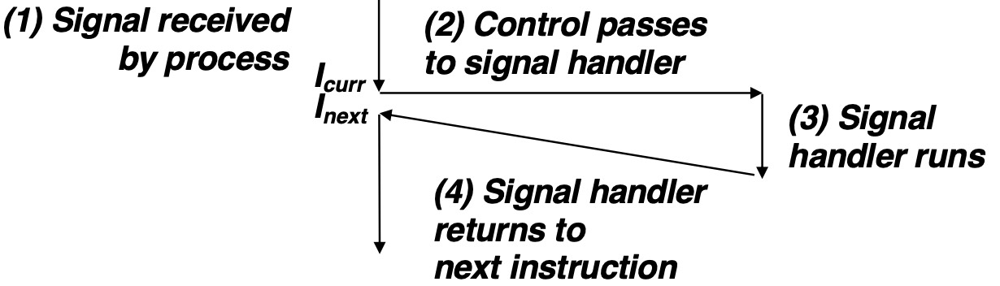

## Shell

A shell is an application program that runs programs on behalf of the user.

在 Linux 中，shell 是一个命令行界面，用户可以通过 shell 输入命令，shell 会将这些命令传递给操作系统执行。

```c
#include "csapp.h"
#define MAXARGS   128

/* Function prototypes */
void eval(char *cmdline);
int parseline(char *buf, char **argv);
int builtin_command(char **argv); 

int main() 
{
    char cmdline[MAXLINE]; /* Command line */

    while (1) {
	/* Read */
	printf("> ");                   
	Fgets(cmdline, MAXLINE, stdin); 
	if (feof(stdin))
	    exit(0);

	/* Evaluate */
	eval(cmdline);
    } 
}
```

这是一个最简单的 shell 程序，功能是：**读取用户输入的命令行，然后执行这个命令行。**

```c
/* eval - Evaluate a command line */
void eval(char *cmdline) 
{
    char *argv[MAXARGS]; /* Argument list execve() */
    char buf[MAXLINE];   /* Holds modified command line */
    int bg;              /* Should the job run in bg or fg? */
    pid_t pid;           /* Process id */
    
    strcpy(buf, cmdline);
    bg = parseline(buf, argv); 
    if (argv[0] == NULL)  
	return;   /* Ignore empty lines */

    if (!builtin_command(argv)) { 
        if ((pid = Fork()) == 0) {   /* Child runs user job */
            if (execve(argv[0], argv, environ) < 0) {
                printf("%s: Command not found.\n", argv[0]);
                exit(0);
            }
        }

	/* Parent waits for foreground job to terminate */
	if (!bg) {
	    int status;
	    if (waitpid(pid, &status, 0) < 0)
		unix_error("waitfg: waitpid error");
	}
	else
	    printf("%d %s", pid, cmdline);
    }
    return;
}
```

在 `eval` 函数中，首先调用 `parseline` 函数解析命令行，将命令行分解为一个个参数，并存储在 `argv` 数组中。之后根据第一个参数，分类执行：

- 是内置命令（如 `quit`），则调用 `builtin_command` 函数处理这个命令。
- 是可执行目标文件，则调用 `Fork` 函数创建一个子进程，然后在子进程中调用 `execve` 函数执行这个命令。
- 然后根据 `bg` 变量判断这个命令是前台进程还是后台进程，如果是前台进程，则调用 `waitpid` 函数等待子进程结束；如果是后台进程，则打印出子进程的 PID 和命令行，不等待子进程结束。

这个简单 shell 的缺陷是：终端作为父进程，并不知道子进程何时终止结束，无法回收子进程的资源。

由此需要引入 Signals。

## Signals

这个问题用需要之前学习过的 ECF 来解决，这部分对于实现 shell 非常重要。

A**「signal」**is a small message that notifies a process that an event some type has occurred in the system.

是由**内核**发送给**进程**的一个消息，用 $1\sim 30$ 的小整数表示，代表不同含义。

> 具体信号含义可以用 `man 7 signal` 查看。

### Sending a Signal

发送信号。从 Kernel 到 Destination process 传递，改变进程 **上下文（Context）**中的某些状态。

**「Process Group 进程组」**

- 每个进程都要属于，也只属于一个进程组，进程组也有 ID。
- 默认情况下，子进程和他的父进程同属于一个进程组。
- 可以用 `getpgrp()` 获取进程组，用 `setpgrid()` 改变进程组。

**「/bin/kill 程序」**

- 是系统提供的一个命令行工具，用来发送信号给进程。
- 它的名字是 kill，但它并不一定会杀死进程，**可以发送任何指定信号给任何进程。**
- `/bin/kill -9 15213` 中，信号 9 是 SIGKILL，15213 是**进程 PID**。
- `/bin/kill -9 -15213` 中，信号 9 是 SIGKILL，15213 是**进程组 ID**，会杀死这个组中的每个进程。

**「Keyboard」**

- 输入 `Ctrl+C` 会发送 `SIGINT` 信号，终止前台进程组的所有作业。
- 输入 `Ctrl+Z` 会发送 `SIGTSTP` 信号，挂起前台进程组的所有作业。
- 前台进程组中，可能会有多个进程在运行，比如指令 `ls | sort` 就会创建两个进程，分别是 `ls` 和 `sort`，它们同属于前台作业的进程组。

**「kill() Function」**

- C 语言中提供了 `kill()` 函数，可以用来发送信号给进程。

- $$
    \mathtt{int}\quad \mathtt{kill(pid\_t\;\;pid, int\;\; sig)}
    $$

- 这个跟 `/bin/kill` 程序一样，都用正负来区分进程和进程组。

### Receiving a Signal

接收信号。

进程被内核要求对信号做出反应后，有以下几种情况可以选择：

- **「Ignore」**直接忽略，什么都不做
- **「Default」**根据信号类型的预定义动作处理，比如终止、忽略、停止。
- **「Catch」**执行一个叫做 **signal handler** 的函数，来处理这个信号，如下图所示。



所以，对于大部分信号，进程可以自己选择：直接忽略，默认处理，或者自定义处理函数。

对于特殊信号 `SIGKILL` 和 `SIGSTOP`，进程不能选择忽略或者捕获，必须终止或者停止。

```c
void handler(int sig) {
    printf("Received signal %d\n", sig);
    exit(0);
}
signal(SIGINT, handler); // 大致实现逻辑如上
```

### Pending and Blocked Signals

这个过程是接收信号之前，信号会被放在一个 Pending 队列中，等待进程处理。

**「Pending」**

- 信号已经发送，但还没有被接收的状态。
- **信号不会排队**。对于每种信号类型，一个进程 **最多只能有一个** 处于 Pending 状态的信号。比如连续发送多次同一个型号 `SIGINT`，也并不会堆积起来，而是只会保留一个。

**「Block」**

- 信号被阻塞，进程不会接收这个信号。
- **Blocked signals can be delivered, but will not be received until the signal is unblocked**

所以就是说，如果信号处于 Blocked 状态，就会持续处于 Pending 状态，直到进程解除 Blocked 状态。

**「Bit Vector」**

- Blocked signals 用一个 Bit Vector 来表示，表示每个信号是否被 Blocked。
- **Pending bit vector**：当某个信号 k 被内核投递给进程时，**内核设置 pending 中的第 k 位为 1**。
- **Blocked bit vector**：当某个信号 k 被屏蔽时，**内核设置 blocked 中的第 k 位为 1**。
- Ready = pending & ~blocked，才会被接收。

**「实现方法」**

`sigprocmask()` 函数可以用来设置 Blocked signals。

具体用法可以自行查询，`man 2 sigprocmask`。

一般是先 `sigprocmask(SIG_BLOCK, &mask, &prev_mask)` 来阻塞，

然后 `sigprocmask(SIG_SETMASK, &prev_mask, NULL)` 来恢复。
