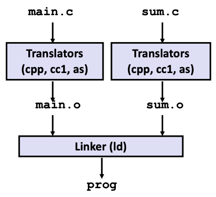
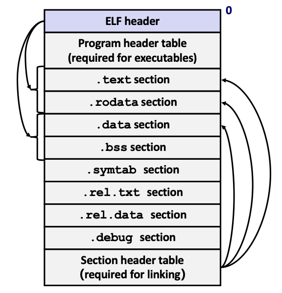
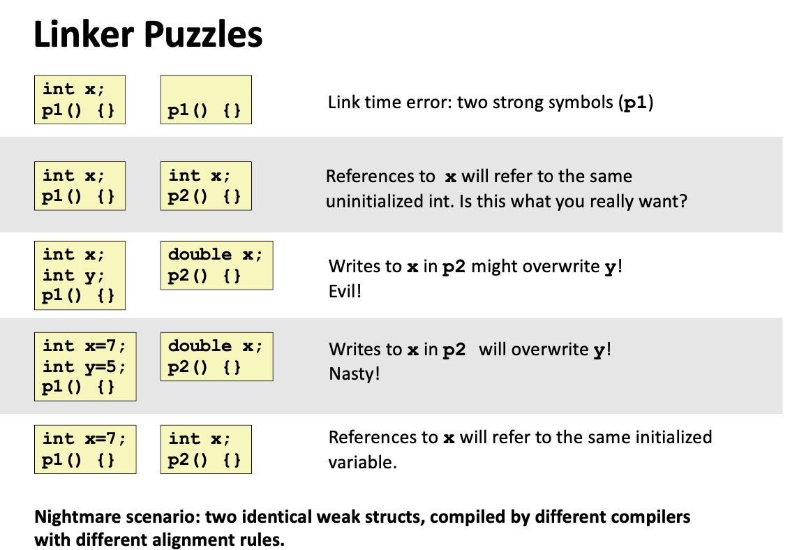
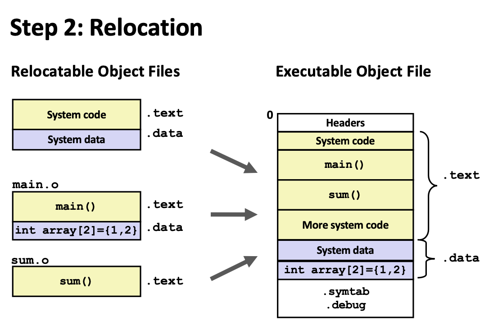
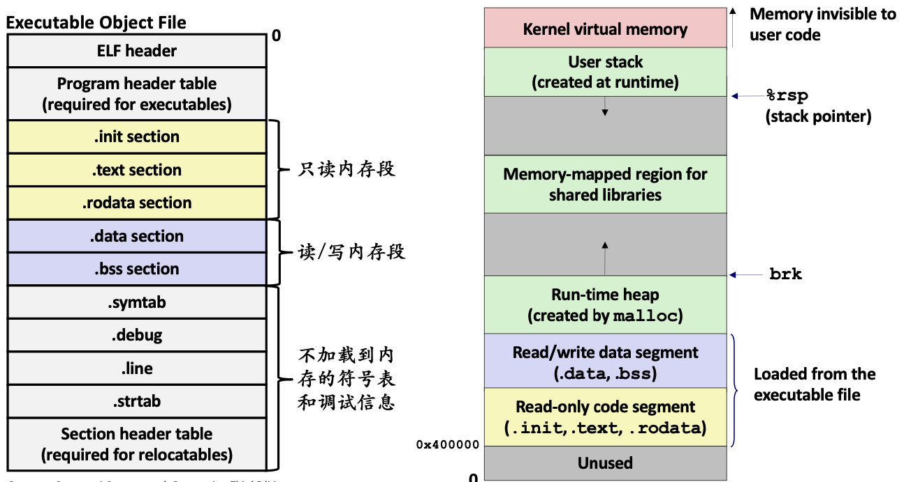
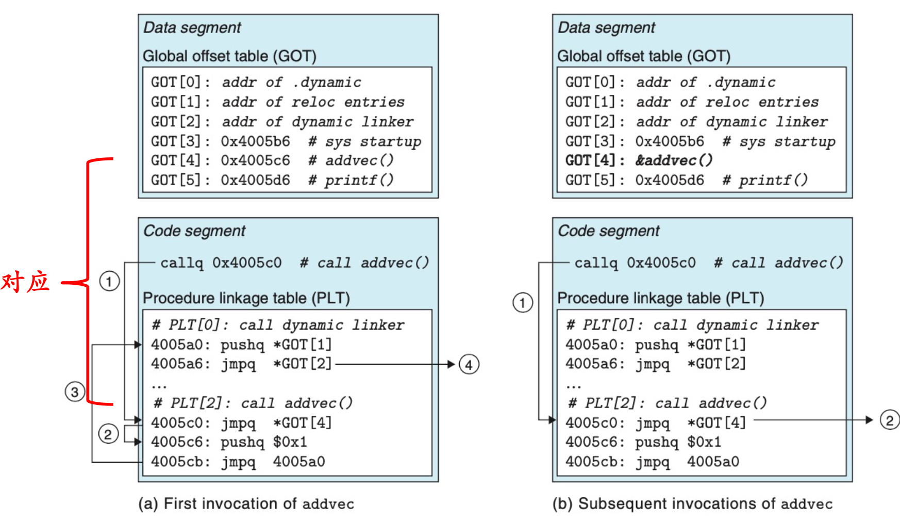

## Why Linking

以一个简单的示例介绍链接过程：

```c
// main.c
int sum(int *a, int n);
int main() {
    // ...
}

// sum.c
int sum(int *a, int n) {
    // ...
    return s;
}

// 在命令行中
gcc -Og -o prog main.c sum.c
```



编译和链接的主要阶段包括以下部分。

- **cpp（预处理器）**：处理宏定义、头文件包含等预处理指令，生成**中间文件** `main.i` 和 `sum.i`。
- **cc1（编译器）** ：将源代码翻译为**汇编语言文件** `main.s` 和 `sum.s`。
- **as（汇编器）** ：将汇编代码转换为**可重定位目标文件** `main.o` 和 `sum.o`。
- **ld（连接器）** ：将多个可重定位目标文件链接成一个**可执行文件** `sum`。

分解的指令为：

```bash
gcc -E main.c -o main.i
gcc -S main.i -o main.s
gcc -c main.s -o main.o
# generate sum.o in the same way
gcc main.o sum.o -o prog
```

## Object Files

目标文件的主要形式包括：

- `.o` 文件：可重定位目标文件。
- 可执行文件：历史上曾经要求后缀名为 `.out`，但可以无后缀，后缀名不重要。
- `.so` 文件：共享对象文件，用于动态链接库。

## Executable and Linkable Format (ELF)

ELF 是一种标准的二进制文件格式，统一以下类型的文件：

- **可执行文件（Executable object files）**
- **可重定位目标文件（Relocatable object files）**
- **共享库（Shared object files）**
- **核心转储（Core dumps）**

### ELF 结构

ELF 具有一种统一的格式，但根据用途不同显示不同的视图：

- **链接视图**：适用于可重定位文件，主要包含用于链接的节信息。
- **执行视图**：适用于可执行文件，主要包含用于程序执行的段信息。



[Github: elfcat](https://github.com/rbakbashev/elfcat) 是一个有用的 ELF 文件可视化工具。

### ELF 的关键组件

- **ELF Header**：描述文件的类型、目标架构、版本等基本信息。
- **Program Header Table**：描述可执行文件在内存中的各段布局。
- **Section Header Table**：描述各可重定位文件中的各节布局。

### 主要的节和段

- **Section（节）**：最小的可处理单位，包含具体的代码和数据，在链接时加载：

    - `.text`：包含程序的机器指令。
    - `.rodata`：包含常量字符串等只读数据。
    - `.data`：包含初始化的全局变量和静态变量。
    - `.bss`：包含未初始化的全局变量和静态变量。
    - `.symtab`：包含程序中的符号信息，如函数名、变量名等。
    - `.rel.text` 和 `.rel.data`：重定位信息。
    - `.debug`：包含调试信息。

- **Segment（段）**：可以由多个节构成，描述程序在内存中的布局，在运行时加载。

### Readelf

`readelf` 是一个用于查看 ELF 文件内容的工具，常用的选项包括：

- `-h`：查看 ELF 头信息。可以查看 `.o` 文件和可执行文件的头信息。
- `-S`：查看节头表信息。用于查看 `.o` 的 Section 信息。
- `-l`：查看程序头表信息。用于查看 Executable object file 的 Segment 信息。

- `-s`：查看符号表信息。查看 symbol table.


## Step1: Symbol Resolution

### Linker Symbols

在链接过程中，符号是非常关键的部分。符号可以分为以下几类：

- **全局符号（Global symbols）**
  - Defined symbol
  - 在当前文件定义的，并且可以被其他模块引用。
  - 普通的**函数和全局变量**（非静态）。这些符号具有全局可见性。

- **外部符号（External symbols）**
  - Undefined Symbaol
  - 定义在其他文件中，于当前文件中引用，需要在其他模块找到定义。
  - 定义在其他模块的外部全局变量。
- **局部符号（Local symbols）**
  - 仅在当前文件中定义和引用，无法被其他模块访问。
  - 用 `static` 关键字定义的 C 函数和全局变量。

**注意：局部链接器符号与局部程序变量不同：**

- Local non-static variables 存在寄存器或栈中，与linker无关。
- Local static variables 存在 `.data` 或者 `.bss` 段中，属于 linker 符号解析工作的一部分，在下面说明。

### Symbol Resolution

在不同文件中定义了各种各样的符号，可能还有相同的符号名。

Linker 的符号解析过程，就是要把这些符号解析成唯一的地址，供可执行文件使用。

### gcc 阶段

gcc 对于一些特殊类型的变量，会存储到特殊段：

- `COMMON`：未初始化的全局变量。
- `.bss`：未初始化的静态变量，初始化为 0 的全局或静态变量。

**「Local Symbols」** 编译器确保局部符号的唯一性。因此无需Linker 特别协调，只需要存储局部符号的地址即可。

**「Global Symbols」** 对于全局符号，每遇到一个弱全局符号，编译器不能确定用哪个定义，就先认为这个符号会出现在其他模块中，具体地：

- 代码中类似 `int x;`（未显式初始化）的全局变量，GCC在符号表中标记为`COMMON`符号。
- 这表示该符号“弱定义”，链接器允许多个目标文件中存在同名的`COMMON`符号，先存到 COMMON 中，并最后将它们统一合并到最终的`.bss`节。
- `COMMON`符号的大小和类型信息存储于符号表，等待链接器安排内存位置。

### 强符号与弱符号

根据编译器规则可见，**这部分只用于全局符号**。

为了解决 Duplicate Symbol Definitions 同名符号，Linker 采用了以下策略：

- **「Strong Symbols」** 已初始化的全局变量、全局函数。
- **「Weak Symbols」** 未初始化的全局变量。 

### Linker 阶段

有如下规则：

- 不允许两个同名的强符号。
- 同时存在强符号和弱符号时，使用强符号。

```c
// foo3.c
#include<stdio.h>
void f(void);
int x = 12345;
int main()
{
    f();
    printf("x = %d\n", x);
    return 0;
}
// bar.c
int x;
void f() {
    x = 56789;
}
```

这段代码中，`bar.c` 中的 `int x` 没有初始化，是弱符号，会被强符号取代。因此运行结果为 `x = 56789`.

- 存在同名的弱符号时，随机选择一个。（目前编译器默认开启 `-fno-common` 选项，同名若符号也会 Linker error）

```c
// foo4.c
#include<stdio.h>
void f(void);
int x;
int main()
{
    x = 12345;
    f();
    printf("x = %d\n", x);
    return 0;
}
// bar4.c
int x;
void f() {
    x = 56789;
}
```

只要满足上述条件，Linker 就不会报错。



## Step2: Relocation

**「重定位」**：调整目标文件中的地址，使得所有符号的引用都能够正确地指向它们在最终可执行文件中的绝对地址。

### 步骤流程

重定位分为两步：

1. 节和符号定义：合并所有相同类型的 Section，给每个聚合节一个地址，**让每条指令和全局变量都有唯一的运行时内存地址**。



2. 符号引用： 修改代码节和数据节中，对符号的引用，指向正确的地址。比如 `call <address>` 的过程。这个部分基于 Relocation Entry.

### ELF Relocation Entry

重定位条目是一个个结构体，存储在 `.rel` 节中，包含以下信息：

- **「Offset 偏移量」** 指明需要修改的位置（比如指令中的立即数或地址）在它所属节中的偏移量。
- **「Symbol Index 符号索引」** 指明需要重定位的符号在符号表中的索引。
- **「Type 类型」** 指明重定位的类型，分为绝对地址类型 R_X86_64_32、相对地址类型 R_X86_64_PC32 等。
- **「Addend 加数」** 指明需要加上的值，帮助链接器精确计算最终填充值。

具体可以在后面的例子中理解，先明确一下这两种重定位类型的区别。

- **「R_X86_64_PC32」** 相对寻址，需要填充的值是 **目标符号的运行时地址加上 Addend**，再减去 **重定位发生后程序计数器 PC 的值**。
- **「R_X86_64_32」** 绝对寻址，需要填充的值是 **目标符号的运行时绝对地址** 加上 Addend。

用下面的例子来进一步解释：

```c
/* main.c */
int sum(int *a, int n);
int array[2] = {1, 2};
int main() 
{
    int val = sum(array, 2);
    return val;
}

// sum.c
int sum(int *a, int n)
{
    int i, s = 0;    
    for (i = 0; i < n; i++) { 
        s += a[i];
    }
    return s;
}        
```

```asm
0000000000000000 <main>:
   0:	48 83 ec 08          	sub    $0x8,%rsp
   4:	be 02 00 00 00       	mov    $0x2,%esi
   9:	bf 00 00 00 00       	mov    $0x0,%edi
			a: R_X86_64_32	array
   e:	e8 00 00 00 00       	callq  13 <main+0x13>
			f: R_X86_64_PC32	sum-0x4
  13:	48 83 c4 08          	add    $0x8,%rsp
  17:	c3                   	retq   
```

假设 Linker 在合并完所有目标文件后，确定了以下运行时地址：

- `main` 函数（`.text` 节起始）的地址为 `0x4004d0`。
- `sum` 函数的地址为 `0x4004e8`。
- `array` 变量（在 `.data` 或 `.bss` 节）的地址为 `0x601020`。

### PC 相对引用的计算方法

`main` 函数中调用 `sum` 函数的指令 `callq 17 <main+0x17>` 实际上是 `e8` 后面跟一个 32 位的相对偏移量。这条指令从 `main` 节的偏移量 `0x12` 开始，相对偏移量本身存储在偏移量 `0x13` 到 `0x16` 的 4 个字节中（当前值是 `00 00 00 00`）。

相应的重定位条目会指向这个位置：

```asm
r.offset = 0xf
r.symbol = sum
r.type   = R_X86_64_PC32
r.addend = -4
# 下面会请关注 `offset` 和 `addend` 字段的用途。
```

**「Offset」** 字段的作用就是告诉 Linker 需要修改的值的位置，记为 $\mathtt{refaddr}$，计算方法为：
$$
\mathtt{refaddr}=\text{ADDR(r.main)}+\text{r.offset}
$$
代入具体数值计算：
$$
\mathtt{refaddr}=\mathtt{0x4004}+\mathtt{0xf}=\mathtt{0x4004df}
$$
 **「Addend」** 字段就是为了让 Linker 计算出需要填充到 $\mathtt{refaddr}$ 位置的值，记为 $\mathtt{*refptr}$，计算方法为：
$$
\mathtt{*refptr} = \text{ADDR(r.symbol)} + \text{r.addend} - \text{r.refaddr}
$$
代入具体数值计算：

$$
\mathtt{*refptr}=\mathtt{0x4004e8}-4-\mathtt{0x4004df}=\mathtt{0x5}
$$

Linker 会将 `0x5` 这个值填充到 `0x4004d0 + 0xf` 的位置。

当 CPU 执行到 `callq` 指令时，它会计算当前 PC 值 (`0x4004e3`) 加上操作数 (`0x5`)，得到 `0x4004e8`，从而实现正确的函数调用跳转。

PC 寄存器会存储下一条指令 `13: add $0x8,%rsp` 的地址。$\text{PC}=\mathtt{0x4004d0+0x13=0x4004e3}$.

Linker 并不知道 PC，所以才需要编译器提供这个 r.addend 辅助。

### 绝对引用

这部分相对就很简单了。

```asm
r.offset = 0xa
r.symbol = array
r.type   = R_X86_64_32
r.addend = 0
```

`offset` 的含义不变，`addend` 完全用不上。

填入的地址直接就是 $\text{ADDR(array)}$，由于 `array` 是全局变量，Linker 会在 `.data` 段中找到它的地址。

## Loading

Loading Executable Object Files 加载可执行目标文件。




## Libraries

分为静态和动态两种。

静态库就用于前面讲到的静态链接的两个步骤中，而动态库用于动态链接。

### Static Libraries

把所有相关的目标文件打包成单独文件，来避免编译器重复编译。

静态库的后缀为 `.a`，在 Linux 中使用 `ar` 命令创建。

在使用 `gcc` 创建可执行文件时，可以直接指定静态库的路径和名称，编译器会自动链接。

```bash
gcc -c main.c
gcc -o program main.c libx.a liby.a
```

一个很重要的话题也很令人迷惑的话题是，链接器会在符号解析阶段，按照命令行输入的顺序，从左到右依次链接静态库。因此，不同的顺序会导致不同的结果，错误的顺序可能会导致符号解析错误。

下面描述一下具体过程。

定义集合 $U$ 存储未被解析的符号，集合 $E$ 存储可重定位目标文件，集合 $D$ 存储已被解析的符号。

之后从左到右依次处理，若当前文件为：

- **目标文件 $f$**，直接加入 $E$，然后对于其中的每个符号 $s$，不断调整集合 $U$ 和 $D$。用 $s$ 来匹配 $U$ 中出现的未定义符号，也可能 $s$ 是未定义符号，需要加入 $U$. 
- **静态库存档文件 $f$**，如果某个成员 $m$ 定义了 $U$ 中的引用，则把 $m$ 加到 $E$ 中，而不是整个静态库，之后更新 $U$ 和 $D$。

对于比较复杂的情况，比如  `foo.c` 调用 `libx.a`，`libx.a` 调用 `liby.a`，`liby.a`又调用 `libx.a`，则：

```bash
gcc foo.c libx.a liby.a libx.a
```

可以重复出现 `libx.a` 来满足依赖。

### Shared Libraries

共享库，主要用于在动态链接过程中。

共享库是解决静态库缺陷的现代创新产物，可以作为模块被加载到任意内存地址。

共享库是一组可被多个程序共享使用的二进制代码文件，通常以`.so`作为文件后缀（Linux下）。这些库文件包含位置无关的代码（PIC），以便于被加载到进程内存的任意位置。

**「编译共享库」**

生成共享库时，必须使用`-fPIC`（Position Independent Code）选项，确保代码不依赖固定地址。

使用示例：

```bash
gcc -fPIC -c foo.c -o foo.o
gcc -shared -o libfoo.so foo.o
```

生成的`libfoo.so`即为可被动态链接的共享库。

**「链接共享库」**

编译时，程序自身不会包含库代码，只含符号引用和运行时链接的指令。

加载时，动态链接器才会将共享库加载到内存中，并解析符号引用，之后再控制转移给程序。此刻，共享库的位置才是确定的。

## Library interpositioning

库打桩技术。

截获所有某个函数的调用，进而实现一些操作。

### Applications

下面是库打桩在 **「Monitoring and Profiling」** 方面的应用：

- 记录函数调用次数
- 记录函数调用位置和参数
- 内存监控（内存泄漏、内存访问的 trace）

### Implementation	

库打桩可以在三个阶段进行：

- **Compile-time** ：在编译时插入打桩代码。
- **Link-time** ：在链接时插入打桩代码。
- **Run-time** ：在运行时插入打桩代码。

共同的实现逻辑是，类似于自己创建一个函数覆盖原本的库函数，来增加所需功能。只是根据条件不同，需要在不同阶段插入，也就有不同的代码实现方式。

其中，**Run-time** 方法不需要知道源代码，可以自己额外重写函数，直接在运行时插入打桩代码。

## PIC 位置无关代码

Position-Independent Code, PIC.

在上面讲过的 Relocation 过程中，PC32 的**相对寻址**条目对应的代码段一定是 **PIC**。

因此，对于 PIC 模块，可以把代码段加载到内存的任何位置，而无需链接器做任何修改。这使得共享库可以在运行时被加载到内存的任何位置，而不需要重新编译。

因此，动态链接和共享库代码一定要实现 PIC，还可用于随机化地址空间。

### 生成 PIC

根据 gcc 选项 `-fpic` 或 `-fPIC`，略有区别。

`-fPIC`更“完全”，通常用于64位平台共享库编译。

### PIC 数据引用

在共享库中定义的变量，由于不知道共享库会被加载到哪里。根据动态链接的过程，不会把这些符号拷贝到可执行文件中，因此代码段并不能事先知道变量和函数的地址。

但是，我们又不能在执行时动态修改代码段，要保证代码段可以预先编译好不用变。

为了解决这个问题，编译器会在数据引用时使用 **「全局偏移量表 Global Offset Table, GOT」**，在 `.data` 段中。

在 GOT 表中，每个全局符号都有一项，值为全局符号的地址。这个值在运行之前也是未知的，会在运行过程中被动态链接器填充。如此一来，只需在得知符号地址后，修改 GOT 中相关项的值即可。

具体地，在预先编译出的代码段中，符号地址的填充值为 **「GOT 表中某一项的地址」**。在执行代码时，代码会从 GOT 表中读取符号的地址，然后再进行实际的调用。

另外，GOT 中的地址是相对地址，因此可以在运行时被动态链接器修改。

### PIC 函数调用

PIC 的方法为 **「Lazy binding 延迟绑定」**。

需要 **「过程链接表 Procedure Linkage Table」** 辅助，在 `.text` 段中。

GOT 表 与 PLT 表协同，完成 PIC 函数调用指令，下面是具体流程与示例。



- 第一次调用函数时，程序进入 $\mathtt{PLT[2]}$，然后经过 $\mathtt{GOT[4]}$ 跳转到第二条指令，没有什么意义。
- 随后，把动态链接器所需的各种条目压入栈中，它会重写 GOT 表中的值，改为函数的实际地址。
- 之后再次调用函数，先控制转移到 $\mathtt{PLT[2]}$，之后通过 $\mathtt{GOT[4]}$ 直接跳转到实际地址。

上面例子中，有关 $\mathtt{PLT[0-1], GOT[0-3]}$ 的详细作用可以看书。

## 参考资料