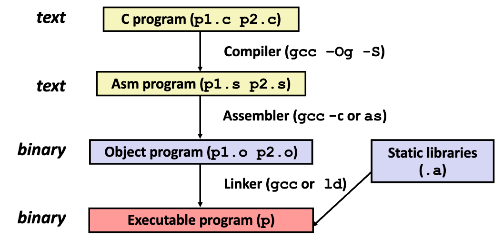
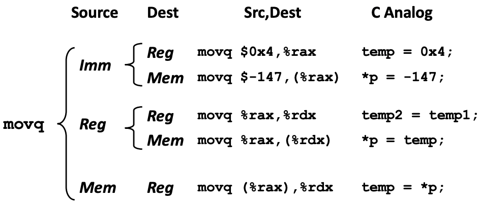

## 程序的机器级表示 1

程序的机器级表示 1

### History of Intel processors and architectures

本书只研究 x86-64 架构的问题。

```bash
> gcc -m64 hello.c
```

### C, Assembly, Machine code

代码格式：

- Assembly Code(汇编代码): A text representation of machine code.
- Object Code(目标代码): 和 Machine Code 差不多，只是少了 link 过程。
- Machine Code(机器代码): The byte-level programs that a processor executes

下面这个由 c 语言转换到机器语言的图展示了这三种语言的关系：



#### Assembly code

下面的指令可以利用生成后缀名为 .s 的汇编文件。

```bash
gcc -Og -S mstore.c # 生成汇编文件mstore.s
```

其中 -Og 是一个适用于调试的优化选项，确保生成的调试信息不会受到影响。


**数据类型：**

| **C语言** | **Intel数据类型** | **汇编后缀** | **字节数** |
| :-------: | :---------------: | :----------: | :--------: |
|   char    |       Byte        |      b       |     1      |
|   short   |       Word        |      w       |     2      |
|    int    |    Double word    |      l       |     4      |
|   long    |     Quad word     |      q       |     8      |
|  char *   |     Quad word     |      q       |     8      |
|   float   | Single precision  |      s       |     4      |
|  double   | Double precision  |      l       |     8      |

**操作：**

是在 Register / Memory 的数据上进行操作：**运算、传送数据（Transfer data）、控制转移（Transfer control）**。

#### Object Code

在 Assembler（汇编器）与 Linker（连接器）之间。

汇编器的功能：

- .s文件汇编为.o文件
- 指令的二进制编码，几乎是可执行的，只差链接过程

下面的指令可以利用生成后缀名为 .s 的汇编文件。

```bash
gcc -Og -c mstore.c # 生成目标代码文件mstore.o
```
这是二进制格式，无法直接查看，需要反汇编工具：

```bash
objdump -d mstore.o
```

来检查 object code，得到与汇编大致对应的代码，以分析指令序列。

### Assembly Basics: Registers, operands, move

寄存器、操作数（运算对象）、数据传送指令。

#### 传送数据

首先以 `movq` 的一个示例来介绍。

**Instruction：** 指令，由操作码(Operation Code)和操作数(Operands)组成。比如下面是用于 Moving Data 的指令：

$$
\mathtt{movq}\; \mathsf{Source, Dest}
$$

其中 $\mathtt{Source}$ 和 $\mathtt{Dest}$ 就是操作数。

**Operand:** 操作数有以下类型：

- **Immediate**: const integer data. 比如：\$0x400, \$533，在前面加个 \$ 即可。
- **Register**: One of 16 integer registers. 共有十六个寄存器，例如 $\mathtt{\%rax}$.
- **Memory Reference**: 8 consecutive bytes of memory at address given by register. 寄存器后的连续八个字节，记作 $\mathtt{(\%rax)}$，加个括号。

在 $\mathtt{movq}$ 指令中，这三者都可以被组合起来，有如下用法：



注意不存在 mem 到 mem 的操作。

#### 完整寻址模式

$$
\begin{array}{rl}
\mathtt{D(Rb, Ri, S)} & \mathtt{Mem[\;Reg[Rb]\;+\;S*Reg[Ri]\;+\;D\;]}
\end{array}
$$

- $\mathtt{D}$：长偏移量，1、2、4 字节
- $\mathtt{Rb}$：基址寄存器，16个整型寄存器中的任意一个
- $\mathtt{Ri}$：索引寄存器，除 %rsp 外的任一寄存器
- $\mathtt{S}$：伸缩值，1，2，4 或 8

这样可以计算出一个地址，然后进行数据传送。

### Arithmetic & logical operations

算数与运算逻辑操作。

#### 地址计算指令

利用寻址模式表达式，可以进行：

- 计算地址但不存储，
- 计算形如 $x + k*y$ 的算数表达式。

$$
\mathtt{leaq\;Src, \;Dst}
$$

这里用到的就是第二种功能，计算算数表达式，例如：

```c
long m12(long x) {
    return x*12;
}
```

转换为汇编语言为：

```asm
leaq    (%rdi,%rdi,2), %rax
salq    $2, %rax
```

其中 $\mathtt{(\%rdi, \%rdi, 2)}$ 是寻址模式表达式，计算 $x + 2x = 3x$，

然后 $\mathtt{salq}$ 是左移两位，即 $3x*2^2 = 12x$。

#### Arithmetic Operations

一些算数操作，包括二元运算和一元运算，这里不进行列举。

在汇编层面，已经不区分有符号数和无符号数的运算，都是对二进制码的操作。

二元运算中，以 $\mathtt{addq\;Src,Dest}$ 为例，表示 $Dest = Dest + Src$，要注意参数的顺序。

例子：

```c
long arith(long x, long y, long z) {
    long t1 = x + y;
    long t2 = z + t1;
    long t3 = x + 4;
    long t4 = y * 48;
    long t5 = t3 + t4;
    long rval = t2 * t5;
    return rval;
}
```

其汇编代码为：

```asm
arith:
    leaq    (%rdi,%rsi), %rax   # t1 = x + y
    addq    %rdx, %rax          # t2 = z + t1
    leaq    (%rsi,%rsi,2), %rdx # for t4
    salq    $4, %rdx            # t4 = y * 48
    leaq    4(%rdi,%rdx), %rcx  # t5 = t3 + t4
    imulq   %rcx, %rax          # rval = t2 * t5
    ret
```

这里寄存器与参数的对应关系为：

| 寄存器           | 参数         |
| ---------------- | ------------ |
| $\mathtt{\%rdi}$ | $\mathtt{x}$ |
| $\mathtt{\%rsi}$ | $\mathtt{y}$ |
| $\mathtt{\%rdx}$ | $\mathtt{z}$ |
| $\mathtt{\%rax}$ | $\mathtt{t1,t2,rval}$ |
| $\mathtt{\%rdx}$ | $\mathtt{t4}$ |
| $\mathtt{\%rcx}$ | $\mathtt{t4}$ |


注意寄存器的重复使用，以及编译器没有显式计算 $t3$ 的值，以节省寄存器。

import { GithubCard } from 'astro-pure/advanced'

<GithubCard repo='TonyYin0418/2025-SPRING-Introduction-to-Computer-System' />