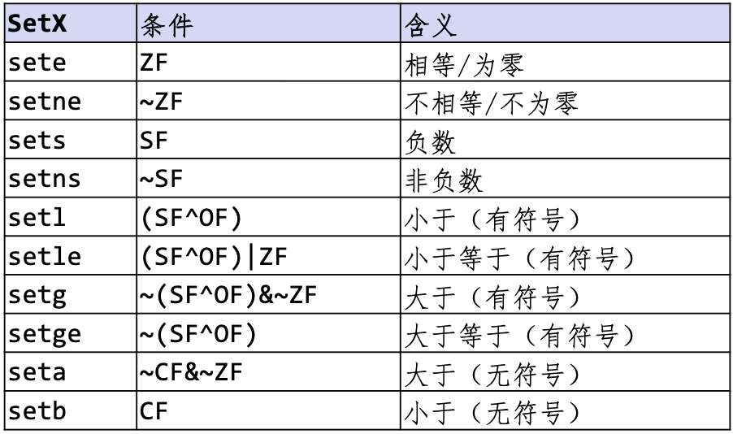
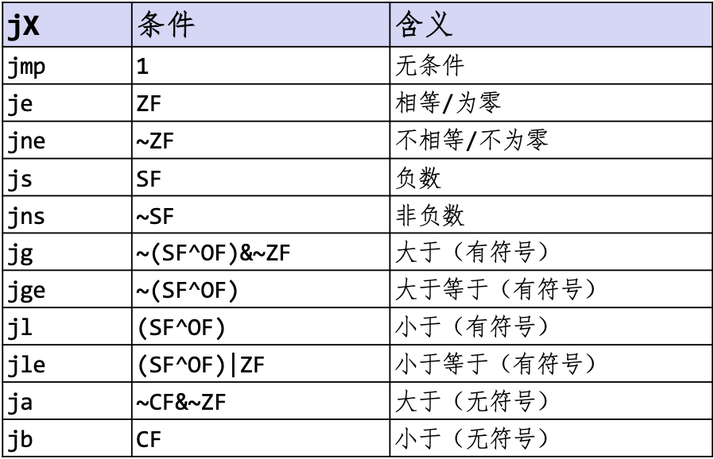
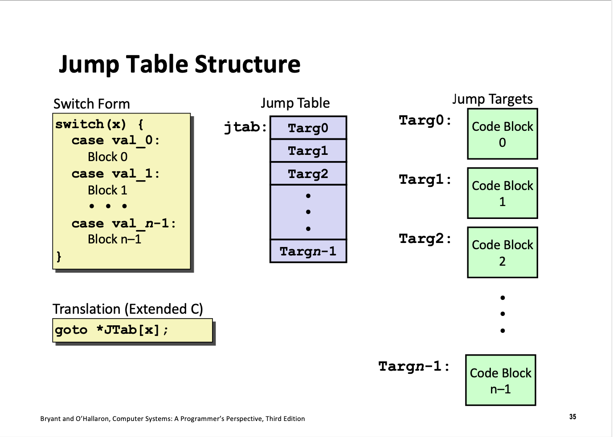
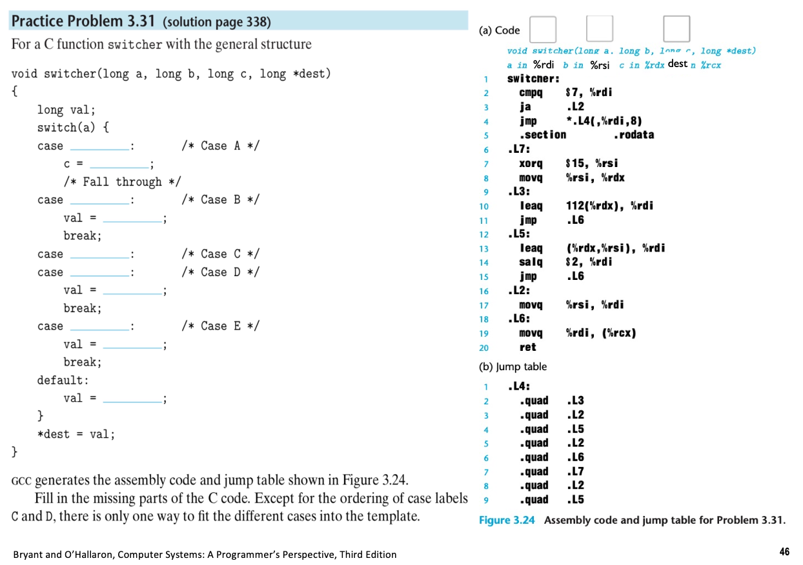

## 程序的机器级表示 2

Machine control

## 控制：条件码寄存器

Control: condition Codes.

### 隐式修改: add等

Implicit Setting.

算术逻辑运算，比如 $\mathtt{addq}$ 和减法等，可以在运算结束后**自动设置**条件码寄存器。

| 简称 | 名称          | 用途                                                         |
| ---- | ------------- | ------------------------------------------------------------ |
| CF   | Carry Flag    | 判断最高位是否进位，**无符号数**溢出（第33位）               |
| ZF   | Zero Flag     | $\mathtt{if:t==0}$                                           |
| SF   | Sign Flag     | $\mathtt{if:t<0}$，只用于有符号数，自动检查符号位。          |
| OF   | Overflow Flag | **有符号数**溢出（第32位）<br>$\mathtt{(a>0 \;\&\&\; b>0 \;\&\&\; t<0) \;||\;(a<0 \;\&\&\; b<0 \;\&\&\; t>=0) }$ |

注意：$\mathtt{leaq}$ 指令下的运算，不会使这四个寄存器改变，只能在算术逻辑运算时使用。

### 关于CF: sub/sbb

在 x86 机器中，减法操作将 CF 当作借位标志位（Borrow Flag），而不是溢出标志位。

- 当计算 $a-b$ 且 $a<b$ 时，CF=1，

- 否则，CF=0。

有两种减法指令，分别是：SBB和SUB。

- 不带借位减法指令：$\mathtt{subq\; b,\; a}$，会计算 $a-b$，不会考虑借位，是较为常用的减法指令。

- 带借位减法指令：$\mathtt{sbbq\; b,\; a}$，会计算 $a-b-CF$，实际上可以用于超过标准字长的128位减法。

### 显式修改: Compare

Explicit Setting.
$$
\mathtt{cmpq\; b,\; a}
$$

相当于计算 $a-b$ 的值，但是不存储到任何地方，只改变 condition codes.

### 显式修改: Test

Explicit Setting.
$$
\mathtt{testq\; b,\; a}
$$

相当于计算 $a\&b$ 的值，但是不存储到任何地方，只改变 condition codes. 

特别地，当 $a$ 和 $b$ 中的一个值是 $mask$ 时，很有用，能且只能改变 ZF 和 SF：

- 设置 $\mathtt{ZF}$，当且仅当 $a\&b=0$ 时；
- 设置 $\mathtt{SF}$，当且仅当 $a\&b$ 的最高位为 $1$ 时。

### 访问条件码

Reading Condition Codes.

有以下操作，可以把条件码寄存器的值（及之间的运算），读取到 $\mathtt{dest}$ 寄存器上。



操作均只修改最低字节，改为为 $0$ 或者 $1$，而不改变原有的其他七个字节数据。但是，寄存器上，前七个字节的数据是未定义的。

为了**清除这七个字节的数据**，例如可以在 $\mathtt{setg\;\%al}$ 之后，用 $\mathtt{movzbl\;\%al, \;\%eax}$ 指令，其中：

- $z$ 表示 zero-extend，即高位补零；
- $b$ 表示 byte，指源操作数是一个字节（8 位）的数据。
- $l$ 表示 long，在这上下文中通常表示目标寄存器是一个 long 类型数据。

其原理是：把一个字节扩展到八个字节。同时，这是一个32位指令，会把更高的七个字节清零。

## 条件分支

Conditional braches

### Jumping 语句

根据控制码寄存器的值，选择是否跳转，并跳转到指定位置。有如下指令：



这里判断的小于或者大于，看的是实际运算中 $b-a$ 的值，注意其与汇编代码中 $a,b$ 的顺序不同。

```asm
absdiff:
	cmpq %rsi, %rdi
	jle  .L4
	...
	ret
.L4:		# %rdi <= %rsi
	...
    ret
```

### Conditional Move 语句

不改变流水线进程的一种条件跳转语句，不要求控制转移。在一些情况下，可以提高运行效率。

这种翻译方式，**会先同时计算两种情况**，然后根据条件码寄存器的值，选择其中一个结果，因此不适用于以下情况：

- 两种情况中，一种会导致异常：`val = p ? *p : 0` 访问空指针的值；
- 计算量很大，不适合同时计算两种情况；
- 计算产生副作用，如 `val = p ? *p++ : 0`。

当然，编译器在以上情况不会选择 Conditional Move，而是会选择 Jumping 语句。

## 循环

Loops.

### do-while循环

是最基本的循环语句，其结构如下：

```asm
loop:
	body-statement
	t = test
	    if (t)
	    	goto loop;
```

### While 循环

while 循环是 do-while 循环的变种，区别在于，首次之前会先执行 test。

#### Jump to middle

这是第一种翻译方法，利用 `goto` 语句。

```asm
	goto test;
loop:
	body-statement
test:
    t = test-expr
    if (t)
        goto loop;    
```

#### Guarded-do

先用条件分支，然后转化为 do-while，优化程度更高。

```asm
t = test-expr
if (!t)
    goto done
do:
    body-statement
    t = test-expr    
    if (t)
        goto do; 
done:
```

### For 循环

会被翻译为 while 循环。

## Switch 语句

Switch Statements.


### 跳转表

Jump Table Structure.

跳转表用数组存。

通常情况下，数组的第 $0$ 位对应变量 $x$ 的最小值，第 $n$ 位对应最大值，而数组中的值则是对应的代码地址。

对于稀疏的情况，编译器会使用 if-else 语句，而不是跳转表。

### 跳转步骤

通过跳转表来访问代码位置，是执行switch语句的关键步骤。如图所示：



Multiple case labels，Fall through cases，Missing cases 是 switch 语句的三个特殊情况。

其中：

- Multiple case labels 在跳转表中，会有多个地址指向同一个代码块。

- Fall through cases 指的是不含 `break` 语句的 case 语句，会顺序执行或直接跳转到下一个语句。

- Missing cases 指的是没有在跳转表中的 case 语句，会**指向 default 语句**。

**一个例题：**



