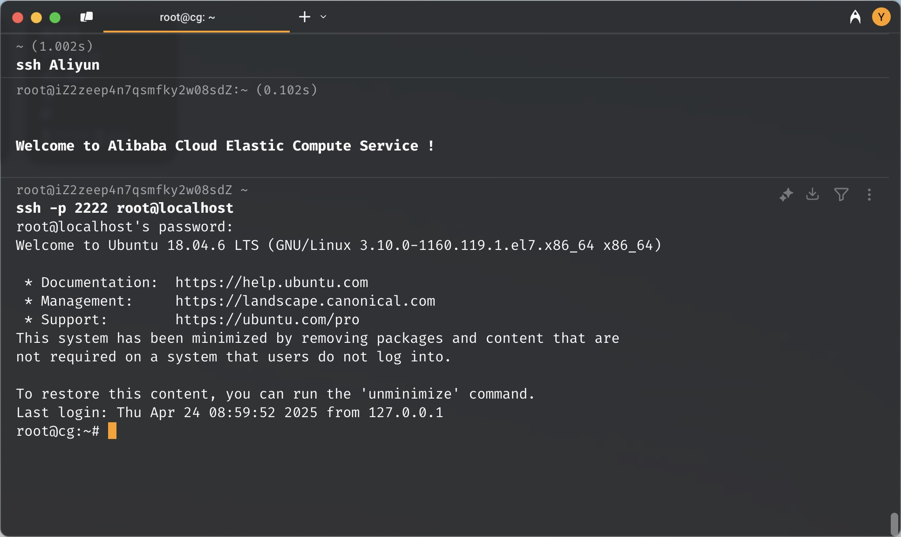

内容由 AI 辅助完善，请注意甄别。

希冀平台的桌面系统分辨率很低，还动不动就要重新连接，便捷性上不如直接用 SSH 连接到虚拟机上进行操作。

由于希冀平台的虚拟机处于学院内网，外网无法直接访问，但虚拟机本身又可以访问公网，这种特殊的网络环境导致我们无法直接从外部通过 SSH 连接到虚拟机。

为了解决这个限制，我们利用虚拟机能够访问公网的这一特点，通过在虚拟机上搭建 SSH 服务并借助反向 SSH 隧道，将虚拟机的 SSH 端口映射到云服务器（公网服务器）上。

这样，我们就可以借助云服务器作为跳板，实现从外网安全便捷地访问处于内网的虚拟机。

这里记录了通过反向 SSH 隧道实现云服务器跳板机访问的全过程。适合无 systemd 容器或极简系统，以及需要内网穿透的场景。以下是详细的配置过程和经验分享。

## 0. 我的环境

阿里云服务器，系统为 Ubuntu 24.04 LTS，有弹性公网 IP。

请确保你的本机可以通过 SSH 正常连接这台跳板机，方法不在此展开。

---

## 1. 安装 SSH 服务

首先，更新软件源并安装 SSH 服务（openssh-server）：

```bash
apt update
apt install openssh-server
```

> 注意：在某些极简容器系统中，安装过程中可能会出现一些报错，且没有 systemd 管理服务，这些错误可以暂时忽略，后续手动启动 sshd 即可。

---

## 2. 手动启动 SSH 服务

由于没有 systemd，无法通过 `systemctl` 启动服务，需要手动创建运行目录并启动 sshd：

```bash
mkdir -p /var/run/sshd
/usr/sbin/sshd
```

你可以用下面命令验证 SSH 服务是否已启动：

```bash
ps aux | grep sshd
```

---

## 3. 配置 SSHD 服务参数

在希冀平台上，编辑 SSH 配置文件 `/etc/ssh/sshd_config`，确保内容包括：

```text
Port 22
ListenAddress 0.0.0.0
ListenAddress ::
PermitRootLogin yes
PasswordAuthentication yes
```

在跳板云服务器上，编辑 SSH 配置文件 `/etc/ssh/sshd_config`，确保内容包括：

```text
GatewayPorts yes
AllowTcpForwarding yes
```

完成修改后保存文件。

---

## 4. 重启 SSH 服务

因为没有 systemd，需要手工杀死并重新启动 sshd：

```bash
pkill sshd
/usr/sbin/sshd
```

---

## 5. 设置 root 用户密码

给 root 用户设置一个密码，方便远程登录：

```bash
passwd root
```

---

## 6. 配置反向 SSH 隧道

在本机执行反向隧道命令，将远程服务器端口（例：2222）映射为容器的 SSH 端口：

```bash
ssh -N -R \*:2222:localhost:22 root@yourip
```

或者使用 `autossh`，好像可以自动保持连接不断。

```bash
autossh -M 0 -N -o "ServerAliveInterval=30" -o "ServerAliveCountMax=3" -R \*:2222:localhost:22 root@yourip
```

如果服务器不支持密码登录，建议先生成 SSH 密钥对方便免密登录：

```bash
ssh-keygen -t rsa
```

一路回车使用默认配置即可。然后查看公钥内容：

```bash
cat ~/.ssh/id_rsa.pub
```

将公钥复制并粘贴到云服务器对应用户的 `~/.ssh/authorized_keys` 文件中。

确认无误后，重新运行反向隧道命令：

```bash
ssh -N -R \*:2222:localhost:22 root@yourip
```

不显示错误即表示连接成功。

---

## 7. 通过跳板机访问容器 SSH

登录云服务器后，通过本地端口转发或直接 ssh 连接到已映射的端口：

```bash
ssh -p 2222 root@localhost
```

> 若之前修改了连接配置，避免因为 host key 变动导致连接失败，可先清理旧的 `known_hosts` 记录：

```bash
ssh-keygen -f ~/.ssh/known_hosts -R '[localhost]:2222'
```

这里还可能因为，对于希冀平台上的不同实验，会打开不同机器。如果重复配置，也需要清理旧的记录。

成功效果如下：



---

## 8. 本地 VS Code 使用跳板机

还可以将云服务器设置为跳板机，配置 ProxyJump。这样可以直接在本机以一行指令连接，但是区别不大。

具体方法可以询问大模型或参考网上教程。

---

## 9. 注意事项

平台貌似会定期休眠？原因不明。

如果连接断了，需要先重新启动 sshd 服务，然后重新开启反向隧道。

```bash
/usr/sbin/sshd
ssh -N -R \*:2222:localhost:22 root@yourip
autossh -M 0 -N -o "ServerAliveInterval=30" -o "ServerAliveCountMax=3" -R \*:2222:localhost:22 root@yourip
```

