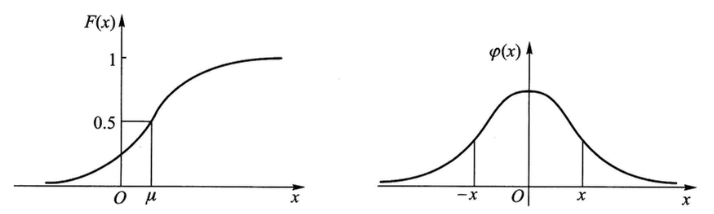

第二章：随机变量及其分布。

本章主要讨论单个随机变量的分布律、分布函数、概率密度等概念。

## 随机变量

**「定义」** 设随机试验的样本空间为 $S=\{e\}$，$X=X(e)$ 是定义在样本空间 $S$ 上的实体单值函数，称 $X=X(e)$ 为随机变量。

一般用大写字母 $X, Y, Z, W\dots$ 代表随机变量，用小写字母 $x, y, z, w$ 代表实数。

随机变量分为：**离散型随机变量、连续型随机变量**。

## 分布律

这部分是对于**离散型随机变量**的讨论。

**「定义」** 设随机变量 $X$ 的取值范围为 $x_1, x_2, \dots, x_n$，$p_i=P(X=x_i)$，$i=1, 2, \dots, n$，则称 $p_i$ 为随机变量 $X$ 的分布律。

**「性质」**

- $p_i \geq 0$，$i=1, 2, \dots, n$，
- $\sum\limits_{i=1}^n p_i = 1$.

### 0-1 分布

又称两点分布。

设随机变量 $X$ 只可能取 $0$ 和 $1$ 两个值，分布律为：
$$
\begin{array}{c|cc}
X & 0 & 1\\ \hline
p_i & 1-p & p
\end{array}
$$

### 二项分布

**「伯努利试验」**

设试验 $E$ 只有两个可能结果：$A$ 及 $\bar A$。

分布律与两点分布相同，即：$p(A)=p,p(\bar A)=1-p$

**「$n$ 重伯努利试验」**

将 $E$ 独立重复地进行 $n$ 次。分布律即**二项分布**。

**「二项分布」**

设随机变量 $X$ 表示 $n$ 次独立重复的伯努利试验中事件 $A$ 发生的次数。

分布律为：
$$
p_i = P\{X=i\} = \binom{n}{i}\cdot p^i(1-p)^{n-i}, \quad i=0, 1, \dots, n
$$

则称 $X$ 服从参数为 $n,p$ 的二项分布，记作 $X \sim B(n,p)$。

### 泊松分布

设随机变量 $X$ 取值概率为：

$$
p_i = P\{X=i\} = \frac{\lambda^i}{i!}e^{-\lambda}, \quad i=0, 1, 2, \dots
$$
其中 $\lambda>0$ 为常数，则称 $X$ 服从参数为 $\lambda$ 的泊松分布，记作 $X \sim \pi(\lambda)$ 或 $X\sim P(\lambda)$。

**「泊松定理」**

设 $\lambda>0$ 是常数，$n$ 是任意正整数，设 $np_n=\lambda$，则对于任意固定的非负整数 $k$，有：

$$
\lim_{n \to \infty}\binom{n}{k}p_{n}^k(1-p_n)^{n-k} = \frac{\lambda^k}{k!}e^{-\lambda}
$$
这是一个用泊松分布来逼近二项分布的定理。

## 分布函数

设 $X$ 是一个随机变量，$x$ 是任意实数，函数：
$$
F(x)=P\{X\leq x\},\quad -\infty<x<\infty
$$
为 $X$ 的**分布函数**。

## 概率密度

讨论**连续型随机变量**。

**「概率密度函数」** 若对于分布函数 $F_{X}(x)$，存在非负可积函数 $f(x)$ 使：
$$
F_X(x)=\int_{-\infty}^{x}f(t)\text{d}t
$$
则称 $f(x)$ 为随机变量 $X$ 的**概率密度函数**，简称**概率密度**。

这种变量 $X$ 就是**连续型随机变量**。

下面是三种重要的连续型随机变量。

### 均匀分布

记为 $X\sim U(a, b)$。

**「概率密度」**
$$
f(x)=\left\{
\begin{array}{}
\displaystyle\frac{1}{b-a}, & a<x<b\\
0, & \text{Otherwise}
\end{array}\right.
$$

**「分布函数」**
$$
F(x)=\left\{
\begin{array}{}
0, &x<a\\
\displaystyle\frac{x-a}{b-a}, & a\leq x<b\\
1, & x\geq b
\end{array}\right.
$$

### 指数分布

记为 $X\sim E(\lambda)$ 或 $X\sim \text{Exp}(\lambda)$。

**「概率密度」**
$$
f(x)=\left\{
\begin{array}{}
\frac{1}{\lambda}e^{-\frac{x}{\lambda}}, & x>0\\
0, & \text{Otherwise}
\end{array}\right.
$$
**「分布函数」**
$$
F(x)=\left\{
\begin{array}{}
1-e^{-\frac{x}{\lambda}}, & x>0\\
0, & \text{Otherwise}
\end{array}\right.
$$

### 正态分布

记为 $X\sim N(\mu, \sigma^2)$。

**「概率密度」**
$$
f(x)=\frac{1}{\sqrt{2\pi}\sigma}e^{-\frac{(x-\mu)^2}{2\sigma^2}}, \quad -\infty<x<\infty
$$
其中 $\mu$ 是常数，$\sigma>0$ 是常数。

**「分布函数」**
$$
F(x)=\frac{1}{\sqrt{2\pi}\sigma}\int_{-\infty}^{x}e^{-\frac{(t-\mu)^2}{2\sigma^2}}\text{d}t
$$

不存在解析表达式。

**「标准正态分布」**

当 $\mu=0,\sigma=1$ 时，称随机变量 $X$ 服从**标准正态分布**。

此时概率密度用 $\varphi(x)$ 表示，分布函数用 $\varPhi(x)$ 表示，代入有：
$$
\varphi(x)=\frac{1}{\sqrt{2\pi}}e^{-\frac{x^2}{2}}
$$

$$
\varPhi(x)=\frac{1}{\sqrt{2\pi}}\int_{-\infty}^{x}e^{-\frac{t^2}{2}}\text{d}t
$$

并且有性质：
$$
\varPhi(-x)=1-\varPhi(x)
$$

对于 $\varPhi(x)$，有很多函数表可供查询使用。

**「正态分布的计算」**

正态分布的计算一般使用标准化的方法。

**引理**：若随机变量 $X\sim N(\mu, \sigma^2)$，则 $Z=\frac{X-\mu}{\sigma}\sim N(0, 1)$，即可标准化。

于是若 $X\sim N(\mu, \sigma^2)$，其分布函数 $F(x)$ 可以写为：
$$
F(x)=P\{\frac{X-\mu}{\sigma}\leq \frac{x-\mu}{\sigma}\}=\varPhi(\frac{x-\mu}{\sigma})
$$
进一步查表即可。
