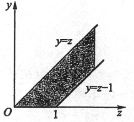

第三章：多维随机变量及其分布。

本章主要讨论两个或两个以上的随机变量。

## 二维随机变量

二维随机变量 $(X, Y)$ 看作整体进行研究。

**「联合分布函数」**

定义二元函数：
$$
F(x, y)=P\{(X\leq x)\cap (Y\leq y)\} \xlongequal[]{\text{written as}}P\{X\leq x, Y\leq y\}
$$
为二维随机变量 $(X,Y)$ 的**分布函数**，或随机变量 $X$ 和 $Y$ 的**联合分布函数**。

一些性质：

- 关于 $x$ 和 $y$ 单调不减。
- $0\leq F(x, y)\leq 1$.
- $F(x, y)$ 关于 $x$ 右连续，关于 $y$ 右连续。
- 对于任意 $(x_1, y_1)$, $(x2,y2)$, $x_1<x_2$, $y_1<y_2$，有：

$$
F(x_2, y_2)-F(x_1, y_2)-F(x_2, y_1)+F(x_1, y_1)=P\{x_1<X\leq x_2, y_1<Y\leq y_2\}\geq 0
$$

**「联合概率密度」**
$$
F(x, y)=\int_{-\infty}^{y}\int_{-\infty}^{x}f(u, v)\text{d}u\text{d}v
$$

其中 $f(x, y)$ 称为 $(X, Y)$ 的**概率密度**，或 $X$ 和 $Y$ 的**联合概率密度**。

一些性质：

- $f(x,y)\geq 0$

- $\int_{-\infty}^{\infty}\int_{-\infty}^{\infty}f(x,y)\text{d}x\text{d}y=F(\infty,\infty)=1$

- $P\{(X, Y)\in G\}=\iint\limits_{G}f(x, y)\text{d}x\text{d}y$.

- 若在 $(x, y)$ 处连续，则：
  $$
  \frac{\partial^2F(x, y)}{\partial x\partial y}=f(x, y)
  $$
  用处是，可推知：
  $$
  P\{x<X\leq x+\Delta x, y<Y\leq y+\Delta y\}\simeq f(x, y)\Delta x\Delta y
  $$

## 边缘分布

**「边缘分布函数」**

设 $(X, Y)$ 的分布函数为 $F(x, y)$，则 $X$ 的**边缘分布函数**为：

$$
F_X(x)=P\{X\leq x\}=\lim_{y\to \infty}F(x, y)=F(x, \infty)
$$

即：

$$
F_X(x)=F(x, \infty),\quad F_{Y}(y)=F(\infty,y)
$$

**「边缘概率密度」**
$$
f_X(x)=\int_{-\infty}^{\infty}f(x, y)\text{d}y
$$

$$
f_Y(y)=\int_{-\infty}^{\infty}f(x, y)\text{d}x
$$

### 二维正态分布

不是考察重点。

## 条件分布

讨论二维随机变量的条件概率分布。

### 离散型随机变量

离散型很好理解，跟普通的条件概率很像。

**「条件分布律」**

对于二维离散型随机变量 $(X, Y)$，称：
$$
P\{X=x_i \mid Y=y_j \}=\frac{P\{X=x_i,Y=y_j\}}{p\{Y=y_j\}}=\frac{p_{ij}}{p_{\cdot j}},\quad i=1,2\cdots
$$
为在 $Y=y_j$ 条件下随机变量 $X$ 的条件分布律。

### 连续型随机变量

对任意 $x,y$ 都有 $P\{X=x\}=0,P\{Y=y\}=0$，所以不能直接用条件概率公式，而是**用极限定义**如下：

设 $(X, Y)$ 的概率密度为 $f(x, y)$，$(X, Y)$ 关于 $Y$ 的边缘密度函数为 $f_Y(y)$，则有条件概率：
$$
P\{X\leq x\mid y<Y\leq y+\epsilon\} =\frac{P\{X\leq x, y<Y\leq y+\epsilon\}}{P\{y<Y\leq y+\epsilon\}}=\frac{\int_{-\infty}^{x}[\int_{y}^{y+\epsilon}f(x,y)\text{d}y]\text{d}x}{\int_{y}^{y+\epsilon}f_{Y}(y)\text{d}y}
$$
当 $\epsilon \rightarrow 0$ 时，可推得连续性随机变量的相关定义式，对于二维连续型随机变量 $(X, Y)$，称：

**「条件概率分布函数」**
$$
F_{x\mid y}(x\mid y)=P\{X\leq x\mid Y=y\}=\int_{-\infty}^{y}\frac{f(x, y)}{f_{Y}(y)}\text{d}x
$$
**「条件概率密度」**
$$
f_{x\mid y}(x\mid y)=\frac{f(x ,y)}{f_{Y}(y)}
$$

### 例题

> P88：设随机变量 $(X, Y)$ 的概率密度为：
> $$
> f(x, y)=\left\{\begin{array}{rl}
> 1, & |y|<x, 0<x<1 \\
> 0, & \text{Otherwise}
> \end{array}\right.
> $$
> 求条件概率密度 $f_{Y\mid X}(y\mid x)$，$f_{X\mid Y}(x\mid y)$.

先求 $f_X$ 和 $f_Y$，
$$
f_X(x)=\int_{-\infty}^{\infty}f(x, y)\text{d}y=\int_{-x}^{x}1\text{d}y=2x\quad (0<x<1)
$$

$$
f_Y(y)=\int_{-\infty}^{\infty}f(x, y)\text{d}x=\int_{|y|}^{1}1\text{d}x=1-|y|\quad (|y|<1)
$$

之后求条件概率密度，
$$
f_{Y\mid X}(y\mid x)=\frac{f(x, y)}{f_{X}(x)}=\frac{1}{2x},\quad (|y|<x, 0<x<1)
$$

$$
f_{X\mid Y}(x\mid y)=\frac{f(x, y)}{f_{Y}(y)}=\frac{1}{1-|y|},\quad (|y|<x>1)
$$

## 独立性

**「定义」**
$$
P\{X\leq x,Y\leq y\}=P\{X\leq x\}P\{Y\leq y\}
$$
等价于：
$$
F(x, y)=F_X(x)F_Y(y)
$$
**「连续型随机变量」** 下式处处成立
$$
f(x, y)=f_X(x)f_Y(y)
$$
**「离散型随机变量」** 下式处处成立
$$
P\{X=x_i,Y=y_j\}=P\{X=x_i\}P\{Y=y_j\}
$$

## 多个随机变量的分布

### 和的分布

即 $Z=X+Y$ 的分布。

设 $(X, Y)$ 是二维连续性随机变量，则 $Z=X+Y$ 仍为连续性随机变量。

**「分布函数」** 
$$
F_{Z}(z)=P\{Z\leq z\}=\iint\limits_{x+y\leq z}f(x, y)\text{d}x\text{d}y
$$
画图，转化为累次积分：
$$
\begin{aligned}
F_{Z}(z)
&=\int_{-\infty}^{\infty}\text{d}y\int_{-\infty}^{z-y}f(x,y)\text{d}x\\
&=\int_{-\infty}^{\infty}\text{d}y\int_{-\infty}^{z}f(u-y,y)\text{d}u\\
&=\int_{-\infty}^{z}[\int_{-\infty}^{\infty}f(u-y,y)\text{d}y]\text{d}u\\
\end{aligned}
$$

**「概率密度」** 

$$
f_{X+Y}(z)=\int_{-\infty}^{\infty}f(z-y,y)\text{d}y
$$
或同理可得：
$$
f_{X+Y}(z)=\int_{-\infty}^{\infty}f(x,z-x)\text{d}x
$$

**「卷积公式」** 

若 $X$ 和 $Y$ 独立，则 $f(x, y)=f_{X}(x)\cdot f_{Y}(y)$，代入得到：
$$
f_{X+Y}(z)=\int_{-\infty}^{\infty}f_X(z-y)f_{Y}(y)\text{d}y
$$
和
$$
f_{X+Y}(z)=\int_{-\infty}^{\infty}f_X(x)f_{Y}(z-x)\text{d}x
$$
称为 $f_{X}$ 和 $f_{Y}$ 的**卷积公式**，记为 $f_{X}\ast f_{Y}$，是重要公式。

### 商的分布、积的分布

$$
f_{Y/X}(z)=\int_{-\infty}^{\infty}\mid x \mid f(x,xz)\text{d}x
$$

$$
f_{XY}(z)=\int_{-\infty}^{\infty}\frac{1}{\mid x \mid} f(x,\frac{z}{x})\text{d}x
$$

若 $X$ 和 $Y$ 独立，也可以用上述类似的方式进行拆为两个函数的乘积，把 $f(x, y)=f_X(x)\cdot f_Y(y)$ 代入，
$$
f_{Y/X}(z)=\int_{-\infty}^{\infty}\mid x \mid f_X(x)\cdot f_Y(xz)\text{d}x
$$

$$
f_{XY}(z)=\int_{-\infty}^{\infty}\frac{1}{\mid x \mid} f_X(x)\cdot f_Y(\frac{z}{x})\text{d}x
$$

### Min / Max 分布

**「二元情形」** 

先考虑二元情形 $M=\max\{X, Y\}$ 及 $N=\min\{X, Y\}$ 的分布函数，**其中 $X, Y$ 独立**。

由于 $M$ 是最大值，$M\leq z$ 等价于 $X$ 和 $Y$ 都 $\leq z$，固有：
$$
F_{\max}(z)=P\{M\leq z\}=P\{X\leq z\}P\{Y\leq z\}=F_{X}(z)\cdot F_{Y}(z)
$$
类似可得 $N=\min\{X, Y\}$ 最小值的分布函数：
$$
F_{\min}(z)=1-P\{X>z,Y>z\}=1-[1-F_{X}(z)][1-F_{Y}(z)]
$$
**「多元情形」** 

下面推广到 $n$ 个独立随机变量的情况。

对于 $n$ 个相互独立的随机变量 $X1, X2, \cdots, X_n$，有：
$$
F_{\max}(z)=F_{X_1}(z)\cdot F_{X_2}(z)\cdots F_{X_n}(z).
$$

$$
F_{\min}(z)=1-[1-F_{X_1}(z)]\cdot [1-F_{X_2}(z)]\cdots [1-F_{X_n}(z)].
$$

### Rayleigh 瑞利分布

若 $(X,Y)\sim N(0,0,1,1,0)$，求 $Z=\sqrt{X^2+Y^2}$ 的分布。
$$
f(x,y)=\frac{1}{2\pi}e^{-\frac{x^2+y^2}{2}}
$$

**「分布函数」** 
$$
F_Z(z)=P\{x^2+y^2\leq z^2\}=\iint\limits_{D}f(x, y)\text{d}x\text{dy}
$$

计算积分：
$$
\begin{aligned}
F_Z(z)&=\int_{0}^{2\pi}\text{d}\theta\int_{0}^{z}f(r\cos\theta,r\sin\theta)r\text{d}r\\
&=\int_{0}^{2\pi}\text{d}\theta\int_{0}^{z}\frac{1}{2\pi}e^{-\frac{r^2}{2}}r\text{d}r \\
&=\int_{0}^{2\pi}\frac{1}{2\pi}e^{-\frac{z^2}{2}}(1-e^{-\frac{z^2}{2}})\text{d}\theta\\
&=\frac{1}{2\pi}e^{-\frac{z^2}{2}}(1-e^{-\frac{z^2}{2}})2\pi\\
&=1-e^{-\frac{z^2}{2}}\\
\end{aligned}
$$

即：
$$
F_Z(z)=\left\{
\begin{array}{ll}
1-e^{-\frac{z^2}{2}}, &z>0\\
0 ,&z<0
\end{array}
\right.
$$
**「概率密度」** 对分布函数求导，得：
$$
f_Z(z)=\left\{
\begin{array}{ll}
ze^{-\frac{z^2}{2}}, &z>0\\
0 ,&z<0
\end{array}
\right.
$$

### 例题

> P89：设 $X$ 和 $Y$ 是两个**相互独立**的随机变量，其概率密度分别为：
> $$
> f_X(x)=1,\quad0\leq x\leq1
> $$
> $$
> f_Y(y)=e^{-y},\quad y>0
> $$
>
> 求随机变量 $Z=X+Y$ 的概率密度。

首先要画图，并且考虑 $Z$ 的取值，需满足：
$$
\left\{\begin{array}{l}
y\leq z\leq y+1,\\
y>0
\end{array}\right.
$$
图形为：

利用公式积分：
$$
f_Z(z)=\int_{-\infty}^{\infty}f_X(z-y)f_Y(y)\text{d}y
$$

$$
f_Z(z)=\left\{\begin{array}{ll}
\displaystyle \int_{0}^{z}1\cdot e^{-y}\text{d}y=1-e^{-z}, &0<z<1\\
\displaystyle \int_{z-1}^{z}1\cdot e^{-y}\text{d}y=(e-1)e^{-z}, &z\geq 1\\
0,&\text{Otherwise}
\end{array}\right.
$$

